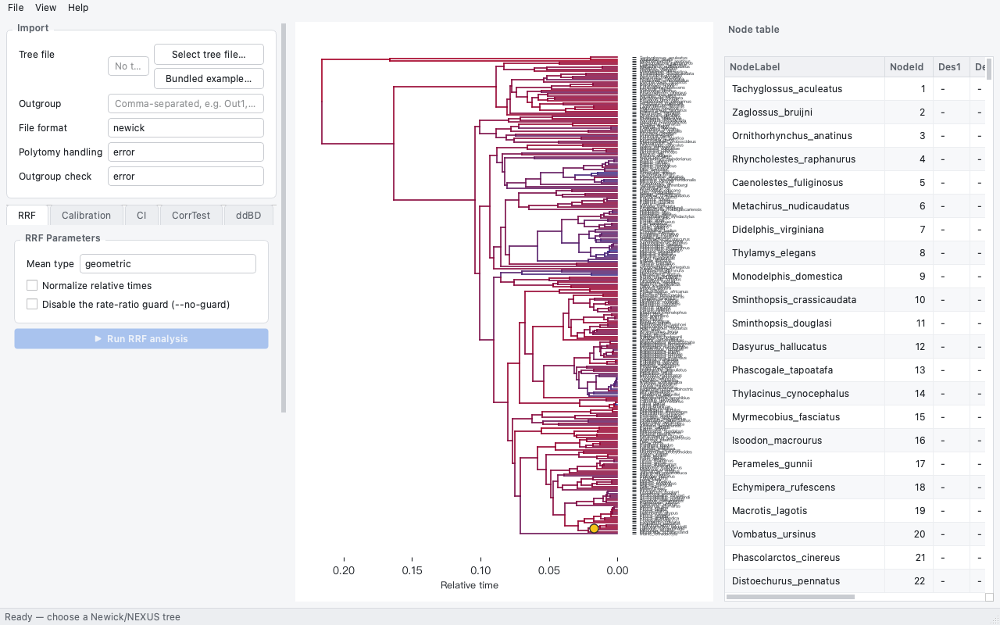
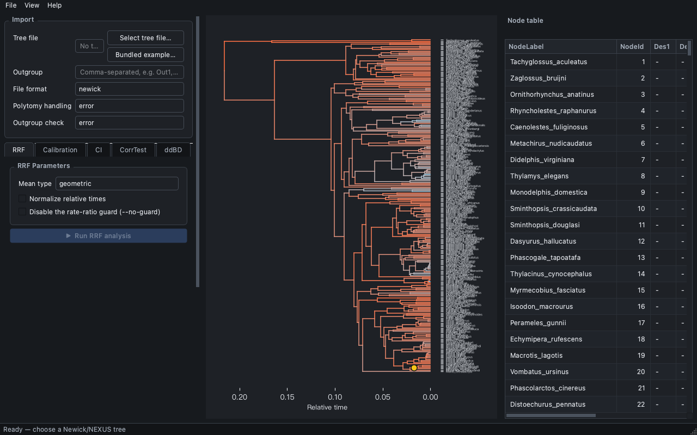
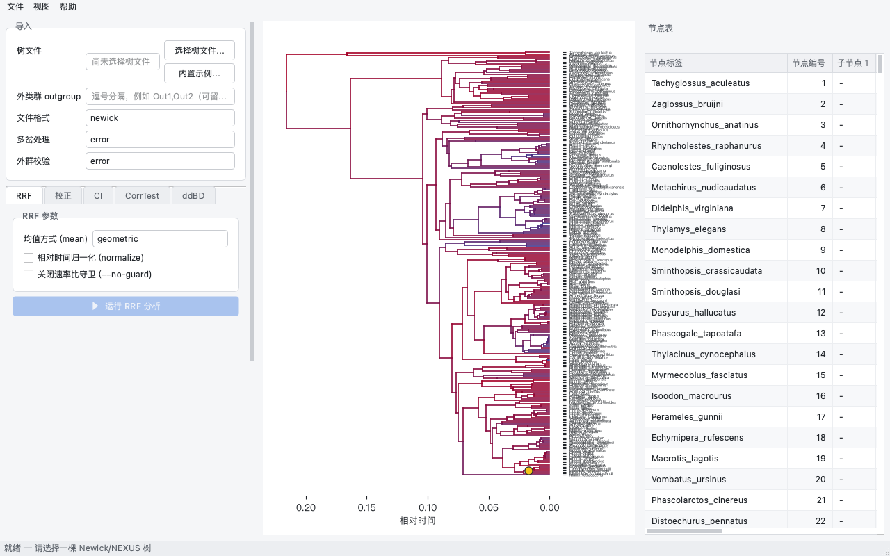
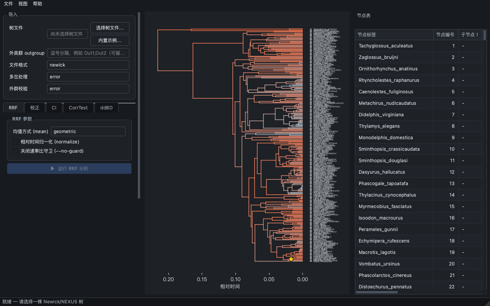
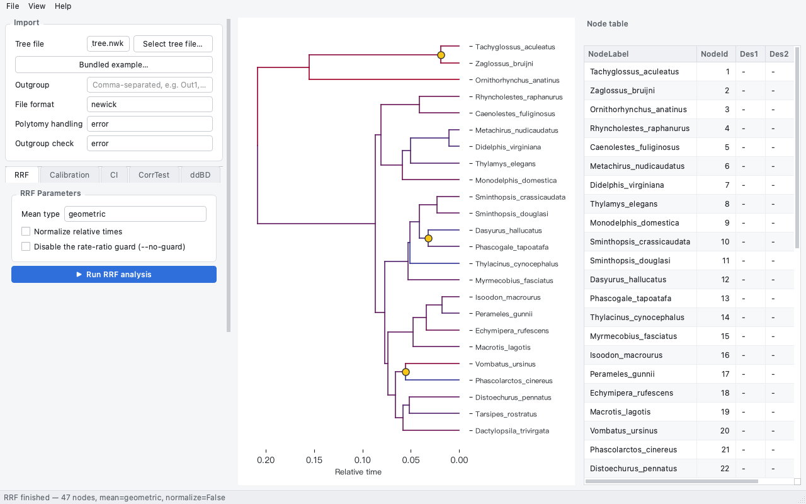

# OpenRelTime Studio

**Language: English** · [简体中文](README-zh.md)

**A native desktop application for relative-rate molecular dating.**
OpenRelTime Studio wraps the [OpenRelTime](https://github.com/ZengZichao/OpenRelTime)
engine in a point-and-click PySide6 interface, so researchers who do not write
code can run RRF dating, place calibrations by clicking on the tree, and export
reproducible results.

Every number comes from the installed `openreltime` distribution through its
public Python API — the GUI reimplements no algorithm, and the analyses match
the command line exactly.

| | |
| --- | --- |
| Interface | 中文 / English, switched live from **View ▸ Language** |
| Tree direction | root on left / right / top / bottom from **View ▸ Root position** |
| Appearance | Light / Dark, switched live from **View ▸ Theme** |
| Icon | Hand-drawn vector SVG (full + small-size variant) |
| Built-in example | **File ▸ Open Bundled Example…** (`Ctrl+I`) — a 24-taxon tree plus demo calibrations, no data needed |
| License | GPL-3.0-or-later |
| Python | ≥ 3.10 |

## Gallery

| English · Light | English · Dark |
| --- | --- |
|  |  |

| 简体中文 · 浅色 | 简体中文 · 深色 |
| --- | --- |
|  |  |

## Install

Neither Studio nor the engine is published to a package index yet, so install
from the files attached to the release. On macOS the app bundle needs no Python
at all — download it, unzip, drag `OpenRelTimeStudio.app` to *Applications*:

```text
https://github.com/ZengZichao/OpenRelTime-Studio/releases/download/v0.1.0/OpenRelTimeStudio-v0.1.0-macOS-arm64.zip
```

Everywhere else, install both wheels in one command. The engine is named with
its `[plot]` extra because Studio's dependency declaration asks for it, and that
is what brings in matplotlib; PySide6 comes with Studio:

```bash
pip install \
  "openreltime[plot] @ https://github.com/ZengZichao/OpenRelTime/releases/download/v0.1.0/openreltime-0.1.0-py3-none-any.whl" \
  "OpenRelTime-Studio @ https://github.com/ZengZichao/OpenRelTime-Studio/releases/download/v0.1.0/openreltime_studio-0.1.0-py3-none-any.whl"
```

> **Distribution.** Those two URLs pin **v0.1.0** — replace the version in both
> together to move to a newer release, since analysis behaviour belongs to the
> engine. In a conda or micromamba environment, activate the target environment
> first and prefer `python -m pip`. An index release will be announced here when
> it happens; until then, or to work offline, install from source (see
> *Development* below).

## Run

```bash
openreltime-studio          # or: python -m openreltime_studio
```

**Try it in thirty seconds:** press `Ctrl+I` (or *File ▸ Open Bundled Example…*).
Studio loads a 24-taxon marsupial/monotreme tree together with three demo
calibration points; press **▶ Run RRF analysis** and the tree, the node table and
the equivalent CLI panel all fill in. The example ships inside the package, so it
works in the frozen `.app` too — and its calibration bounds are illustrative
placeholders, not published dates.



## What you can do

| Module | Purpose |
| --- | --- |
| **RRF** | Relative evolutionary rates and relative divergence times (geometric or arithmetic mean, optional normalisation, rate-ratio guard) |
| **Calibration** | Add calibration points by clicking nodes on the tree, or load a TSV file; `bounds` or `effective` (replicated) method |
| **CI** | Confidence intervals for node ages, with optional per-branch variances |
| **CorrTest** | Rate autocorrelation across the tree (ρ_s, ρ_ad and their decay) |
| **ddBD** | Density-dependent birth–death diversification prior |
| **Export** | CSV / NEXUS / JSON / PNG plus a replayable `run_reltime.sh` of equivalent CLI commands |

Interactive calibration is the reason the GUI exists: click a node, type a
bound, see the marker on the tree. The equivalent-CLI panel shows the exact
commands for what you did, so any session can be reproduced on the command line
or on a cluster.

## Language and theme

* **View ▸ Language** — English / 简体中文; **View ▸ Theme** — Light / Dark.
* Both apply immediately to the whole window, including the matplotlib tree
  canvas; no restart is needed.
* Your choice is remembered between sessions (Qt `QSettings`, organisation
  `OpenRelTime`, application `Studio`). The first launch is English + Light.
* **View ▸ Root position** turns the tree around — root on the left (default),
  right, top or bottom. The time axis flips while the tick values stay true, and
  tip labels always move to the side nearest the tips.
* Interface text lives in per-namespace JSON catalogs under
  `openreltime_studio/locales/{en,zh}/`, so adding a language does not require
  touching widget code.
* The application icon is hand-drawn vector art: a time-scaled tree sweeping out
  of an amber calibration ring, its two clades coloured by rate, isochrone arcs
  behind the tips. Two variants ship
  (`OpenRelTime-Studio.svg` for ≥ 65 px, `OpenRelTime-Studio-symbolic.svg` for
  ≤ 64 px, where the full drawing would smear); `.png` and `.icns` are rasterised
  from them by `openreltime_studio/resources/make_icon.py`.

## Building a standalone app

A prebuilt Apple Silicon bundle is attached to every release (*Install* above).
To build one yourself from this checkout:

```bash
python -m pip install "openreltime[plot] @ https://github.com/ZengZichao/OpenRelTime/releases/download/v0.1.0/openreltime-0.1.0-py3-none-any.whl"
python -m pip install -e .
python -m pip install pyinstaller
pyinstaller openreltime_studio/resources/OpenRelTimeStudio.spec
```

Produces `dist/OpenRelTimeStudio.app` on macOS — double-click, no Python
install required for the end user. `dist/` is build output and is not
committed; the bundle is published as a release attachment.

## Documentation

* [User guide (English)](docs/usage-en.md)
* [用户手册（简体中文）](docs/usage-zh.md)
* [Documentation index](docs/README.md)
* [Changelog (English)](CHANGELOG.md) · [版本记录（简体中文）](CHANGELOG-zh.md)
* Engine documentation and methods: <https://github.com/ZengZichao/OpenRelTime/tree/main/docs>

## Development

```bash
git clone https://github.com/ZengZichao/OpenRelTime-Studio.git
cd OpenRelTime-Studio
python -m pip install "openreltime[plot] @ https://github.com/ZengZichao/OpenRelTime/releases/download/v0.1.0/openreltime-0.1.0-py3-none-any.whl"
python -m pip install -e ".[dev]"

QT_QPA_PLATFORM=offscreen python -m pytest      # headless GUI + adapter suite
python tools/check_i18n.py                      # bilingual catalog / theme-token gate
```

`tools/check_i18n.py` enforces the rules that keep the interface bilingual: no
hard-coded Chinese string literals in widget code, no hard-coded colours outside
`themes.py`, every referenced key present in both languages, no dead catalog
entries. It can also be pointed at individual files during a change.

## Relationship to OpenRelTime

OpenRelTime Studio is a separate project that **depends on** the OpenRelTime
engine and declares it as an install requirement. It carries no copy of the
engine's source, and it calls only the engine's documented public API; if the
engine changes that API, Studio's adapter layer
(`openreltime_studio/adapters/`) is the single place that has to follow.

## License and citation

Distributed under GPL-3.0-or-later, matching the engine. See
[`LICENSE`](LICENSE), [`THIRD-PARTY-NOTICES.md`](THIRD-PARTY-NOTICES.md)
([中文](THIRD-PARTY-NOTICES-zh.md)) and [`CITATION.cff`](CITATION.cff).

## Authors

曾子超 (Zichao Zeng) · [zengzichao@sjtu.edu.cn](mailto:zengzichao@sjtu.edu.cn) ·
[ORCID 0000-0001-6553-970X](https://orcid.org/0000-0001-6553-970X)
