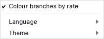

# OpenRelTime Studio user guide

**Language: English** · [简体中文](usage-zh.md)

Version 0.1.0 · Requires Python ≥ 3.10 · Licence GPL-3.0-or-later

This guide covers installation, launching, the window layout, language and
theme switching, the full analysis workflow, the results and export behaviour,
engine warnings and cancellation, troubleshooting, and the developer notes.
The Chinese counterpart is [usage-zh.md](usage-zh.md). The engine
documentation — parameter semantics, methods and validation — lives with
OpenRelTime at <https://github.com/ZengZichao/OpenRelTime/tree/main/docs>.

---

## Contents

1. [What OpenRelTime Studio is](#1-what-openreltime-studio-is)
2. [Installation](#2-installation)
3. [Launching](#3-launching)
4. [Interface tour](#4-interface-tour)
5. [Language, theme and icon](#5-language-theme-and-icon)
6. [Step-by-step workflow](#6-step-by-step-workflow)
7. [Results and export](#7-results-and-export)
8. [Engine warnings, progress and cancellation](#8-engine-warnings-progress-and-cancellation)
9. [Troubleshooting and FAQ](#9-troubleshooting-and-faq)
10. [For developers](#10-for-developers)

---

## 1. What OpenRelTime Studio is

OpenRelTime Studio is a **native desktop application** (PySide6, no browser
involved) for relative-rate molecular dating. It is aimed at researchers who
do not write code: you pick a tree file, fill in a form, click a node on the
tree to place a calibration, and export reproducible results — without
touching a terminal.

What Studio offers:

| Module | What it does for you |
| --- | --- |
| **RRF** | Relative evolutionary rates and relative divergence times from a Newick/NEXUS tree |
| **Calibration** | Absolute times from calibration points added by clicking nodes on the tree or loaded from a TSV file |
| **CI** | Analytical confidence intervals for node ages, plotted as error bars |
| **CorrTest** | Rate autocorrelation across the tree (CorrScore, P-value band, ρ_s and ρ_ad with decay) |
| **ddBD** | Density-dependent birth–death diversification prior, plotted as a fitted density |
| **Export** | CSV / NEXUS / JSON / PNG plus a replayable `run_reltime.sh` of equivalent CLI commands |

### 1.1 The engine does every computation

Studio contains **no algorithm**. Every number is produced by the installed
`openreltime` distribution through its public Python API
(`read_tree`, `rrf_rates_times`, `rrf_times`, `calibrate`,
`confidence_interval`, `corrtest`, `ddbd`), which is called from exactly one
place: the adapter layer `openreltime_studio/adapters/openreltime_adapter.py`.
No analysis function is called from a widget or from the main window — those
modules import only the engine's *result classes* (for type checks, and for the
version line in the About dialog), and the background workers in
`openreltime_studio/workers/analysis_workers.py` reach the engine through the
adapter, from a `QThread` so the interface stays responsive.

Two consequences that matter to you:

* **The results match the command line.** Studio and the `openreltime` CLI run
  the same code on the same inputs, so an analysis done in the GUI reproduces
  exactly on a cluster (see §7.4).
* **The engine is an installed requirement, never a copy.** `openreltime` is a
  declared dependency in `pyproject.toml`, pulled in from the package index
  together with `openreltime[plot]` (matplotlib). Studio ships no copy of the
  engine's source. If the engine changes its public API, the adapter layer is
  the single place that has to follow.

Engine home page: <https://github.com/ZengZichao/OpenRelTime>.

### 1.2 Interface, language and appearance

* Bilingual interface (English / 简体中文), switched live (§5.1).
* Light and dark themes, switched live (§5.2).
* Vector application icon shipped inside the package (§5.5).
* Licensed GPL-3.0-or-later, the same licence as the engine.

---

## 2. Installation

### 2.1 From the release

Neither Studio nor the engine is published to a package index yet, so there are
two ways in: the frozen macOS bundle, or the two wheels.

**macOS, no Python required.** Download and unzip
[`OpenRelTimeStudio-v0.1.0-macOS-arm64.zip`](https://github.com/ZengZichao/OpenRelTime-Studio/releases/tag/v0.1.0),
then drag `OpenRelTimeStudio.app` into **Applications**. The bundle is ad-hoc
signed and not notarised, so the first launch may need right-click → **Open** to
get past Gatekeeper.

**Any platform, from the wheels.** One command installs both; pip resolves their
dependencies (numpy, scipy, pandas, click, matplotlib, PySide6) from the index as
usual:

```bash
pip install \
  "openreltime[plot] @ https://github.com/ZengZichao/OpenRelTime/releases/download/v0.1.0/openreltime-0.1.0-py3-none-any.whl" \
  "OpenRelTime-Studio @ https://github.com/ZengZichao/OpenRelTime-Studio/releases/download/v0.1.0/openreltime_studio-0.1.0-py3-none-any.whl"
```

The package name is `OpenRelTime-Studio` and the importable module is
`openreltime_studio`. The two runtime dependencies are:

| Dependency | Declared requirement | Why |
| --- | --- | --- |
| `openreltime[plot]` | `>=0.1.0` | the analysis engine, plus its plotting extra (matplotlib) |
| `PySide6` | `>=6.5` | the Qt bindings that provide the window, widgets, SVG icon rendering |

In a conda/micromamba environment, activate the target environment first and
prefer `python -m pip` so the packages land in that environment:

```bash
micromamba activate <your-env>       # or: conda activate <your-env>
python -m pip install \
  "openreltime[plot] @ https://github.com/ZengZichao/OpenRelTime/releases/download/v0.1.0/openreltime-0.1.0-py3-none-any.whl" \
  "OpenRelTime-Studio @ https://github.com/ZengZichao/OpenRelTime-Studio/releases/download/v0.1.0/openreltime_studio-0.1.0-py3-none-any.whl"
```

The `dev` extra (pytest, pytest-cov, ruff, mypy) adds nothing to the analysis
features, and ships only from a source checkout — see §2.4.

Check what got installed:

```bash
python -c "import openreltime, openreltime_studio; print(openreltime.__version__)"
```

> **Distribution.** Both wheel URLs pin **v0.1.0**; replace the version in both
> together, because analysis behaviour belongs to the engine. An index release
> will be announced here once one exists. Either way the requirement is
> unchanged: Studio needs the `openreltime` *distribution*, and never a copy of,
> or a path into, the engine's source tree.

### 2.2 Pinning the engine version

Analysis behaviour is the engine's, so a study that must stay reproducible has
to record which engine produced it. The release URLs pin it for you: both install
forms above name `v0.1.0` explicitly, so repeating them rebuilds the same pair.

To move an existing install to a newer engine, point the same argument at the
newer release and let pip upgrade in place:

```bash
python -m pip install --upgrade \
  "openreltime[plot] @ https://github.com/ZengZichao/OpenRelTime/releases/download/v0.1.0/openreltime-0.1.0-py3-none-any.whl"
```

Record the two versions alongside the results; `docs/usage-en.md` §7 describes
what each run writes out.

### 2.3 Supported platforms and Python versions

Exactly as declared in `pyproject.toml`:

| Item | Declaration |
| --- | --- |
| Python | `requires-python = ">=3.10"`; classifiers list 3.10, 3.11, 3.12, 3.13 |
| Desktop platforms | classifiers `Environment :: MacOS X` and `Environment :: Win32 (MS Windows)` |
| Development status | `Development Status :: 4 - Beta` |
| Licence | `GPL-3.0-or-later` |

**macOS and Windows are the declared desktop targets.** No Linux platform
classifier is declared, so Linux is not an advertised target either — although
the CI workflow does run the test suite headless on `ubuntu-latest` and
`macos-latest` across Python 3.10–3.13, and the canvas font fallback list
covers a Linux CJK font. Studio itself contains no compiled extension code and
installs as a pure-Python wheel; the download time of an install is dominated
by the PySide6 wheel it pulls in, not by Studio.

### 2.3.1 Verifying a build

Both the wheel and a frozen bundle can be checked without opening a window:

```bash
openreltime-studio --self-check
```

It confirms the English and Chinese catalogs, the bundled example files and both
icon variants all resolve **inside the installed package**, and exits non-zero
with a `FAIL <what>` line for anything missing — the quickest way to tell whether
a `.app` was packaged with its resources.

### 2.4 Installing from source

A checkout still needs the engine as an installed distribution, and until an
index release exists that means the release wheel:

```bash
git clone https://github.com/ZengZichao/OpenRelTime-Studio.git
cd OpenRelTime-Studio
python -m pip install "openreltime[plot] @ https://github.com/ZengZichao/OpenRelTime/releases/download/v0.1.0/openreltime-0.1.0-py3-none-any.whl"
python -m pip install -e ".[dev]"
```

### 2.5 Building a standalone app (optional)

A prebuilt bundle is attached to every release (§2.1). To make your own — a
double-clickable macOS application with no Python install needed for the end
user — build it with the PyInstaller spec shipped in the package:

```bash
python -m pip install -e .
python -m pip install pyinstaller
pyinstaller openreltime_studio/resources/OpenRelTimeStudio.spec
```

This produces `dist/OpenRelTimeStudio.app`; `dist/` is build output and is not
committed, the bundle is published as a release attachment. The spec bundles the
bilingual message catalogs, the SVG icon and the built-in example
(`openreltime_studio/examples/`: `example_tree.nwk`, `example_calibrations.tsv`
and its `README.md`) — all three are read at run time from inside the package —
forces `console=False`, and sets the bundle identifier
`org.openreltime.studio`. Because the example ships with the bundle,
**File ▸ Open Bundled Example…** works in the frozen `.app` just as it does in a
source install (§3.4).

---

## 3. Launching

### 3.1 The console script

The declared console script is

```text
openreltime-studio = "openreltime_studio:main"
```

so after any install described in §2, start Studio with

```bash
openreltime-studio
```

### 3.2 The module form

If the script directory is not on your `PATH`, run the package as a module:

```bash
python -m openreltime_studio
```

Both forms call `openreltime_studio.main.main()` and open the same window.

### 3.3 What you see at start-up

* A window titled **OpenRelTime Studio**, 1280 × 800 px by default, or restored
  to the size and position you closed it at (saved under the `geometry` and
  `window_state` preference keys).
* The language and theme you chose last session; on the very first launch,
  English and Light (§5.3).
* The status bar reading **Ready — choose a Newick/NEXUS tree**.
* A blank canvas reading *Load a tree — or open the bundled example — and the
  coloured time tree appears here*.
* All **▶ Run** buttons greyed out — they unlock as prerequisites are met
  (§6.1).

Before the window appears, the entry point also sets the matplotlib backend to
`Agg` (drawing happens off-screen and is blitted into the Qt canvas), forces
the **Fusion** widget style, sets a 10 pt application font, applies the theme
stylesheet and palette, and attaches a log handler to the engine's
`openreltime` logger so engine warnings reach the in-window warnings panel
(§8.1) rather than a console you do not have.

Closing the window while a calculation is running asks first: **Analyses are
still running** / "Background jobs are still running and quitting will
interrupt them. Quit anyway?" — the default answer is **No**.

### 3.4 First run: the bundled example

Studio ships a small example so you can walk the whole workflow without hunting
for data. **File ▸ Open Bundled Example…** (`Ctrl+I`), or the **Bundled
example…** button just under the tree-file row, loads a 24-taxon
marsupial/monotreme time tree *and* three demo calibration points in one click.


After it loads you should see:

* the file field showing the bundled `example_tree.nwk` — a path inside the
  installed package, resolved by `openreltime_studio.examples` rather than a
  hard-coded location, so it also works in the frozen `.app`;
* the **Calibration** tab already holding three points, each written as a
  `taxon_set` pair that forms a complete clade, so they stay valid whatever the
  node numbering turns out to be;
* **▶ Run RRF analysis** unlocked; running it draws the tree and fills the node
  table, as above.

> The example's calibration bounds are **illustrative placeholders** picked to be
> mutually consistent so the demo always converges. They are not published dating
> results and should not be cited — see
> `openreltime_studio/examples/README.md`.

---

## 4. Interface tour

### 4.1 Three panes

The window is a single horizontal splitter with three resizable panes
(default widths 360 / 560 / 360 px) plus a status bar underneath the splitter.
Drag the handles to rebalance; the panes have minimum widths and cannot be
collapsed to nothing.

| Pane | Contents |
| --- | --- |
| Left | **Import** group, the five analysis tabs, **Export** group, the engine-warnings button, **Equivalent command line (reproducible)** group. The whole column scrolls. |
| Centre | The interactive tree canvas. |
| Right | **Node table** with a summary line above it. |

### 4.2 Left pane

**Import** group — the settings used when the tree file is read:

| Row | On-screen label | Control |
| --- | --- | --- |
| 1 | Tree file | Read-only path field (placeholder *No tree file selected*) + **Select tree file…** button (tooltip: "Select a Newick / NEXUS tree file (Ctrl+O)"); the **Bundled example…** button sits on its own row directly beneath (tooltip: "Load the 24-taxon example tree and three demo calibrations shipped with the app (Ctrl+I); no data needed to try the full workflow") |
| 2 | Outgroup | Free-text field, placeholder "Comma-separated, e.g. Out1,Out2 (optional)" |
| 3 | File format | `newick` / `nexus` |
| 4 | Polytomy handling | `error` / `random` |
| 5 | Outgroup check | `error` / `warn` |

Below it, five tabs in fixed order: **RRF**, **Calibration**, **CI**,
**CorrTest**, **ddBD** (`校正` in Chinese). Each tab holds its parameter panel
and one accent-coloured **▶ Run …** button at the bottom; the Calibration tab
also holds the calibration-point editor and **Load calibration points from
TSV…**.

Then:

* **Export** group with the **Export results…** button (tooltip: "Export CSV /
  NEXUS / JSON / PNG and the equivalent CLI script (Ctrl+E)").
* The engine-warnings button, hidden until the engine has emitted something
  (§8.1).
* **Equivalent command line (reproducible)** group: a read-only monospace text
  box with the equivalent CLI commands, and the **Copy CLI commands** button
  (§7.4).

### 4.3 Centre: the tree canvas

The canvas draws whichever view the last analysis produced (§6), and shows the
empty hint before anything has run.

| View | Drawn | Axis label |
| --- | --- | --- |
| Time tree (after RRF or calibration) | Rectangular cladogram; branches coloured by rate | *Relative time* after RRF, *Time (Mya)* after calibration |
| Confidence intervals (after CI) | Error bars, oldest nodes first | *Divergence time* |
| ddBD (after ddBD) | Histogram of node times with the fitted birth–death density overlaid | *Node time* / *Density* |

Colour meaning in the time tree:

| Element | Meaning |
| --- | --- |
| Branch colour | Rate of that node, mapped onto a 10-step colour ramp between the theme's `rate_low` and `rate_high`. In Light, the slowest rates are dark red and the fastest dark blue; in Dark the ramp runs orange-red → light blue so it stays legible on a near-black canvas. |
| Flat single-colour branches (`tree_base` token: medium blue in Light, lighter blue in Dark) | Rate colouring is off (**View ▸ Colour branches by rate**, off), or every node has the same rate so the ramp collapses |
| Yellow dot with a dark outline | A node that carries a calibration point |
| Marker + horizontal bar (CI view) | The point estimate and its confidence interval; marker and bar take their two colours from the theme's CI tokens, so they swap hue between Light and Dark while staying distinguishable |
| Fitted curve over a histogram (ddBD view) | The fitted birth–death density on the observed node-time distribution; the curve colour comes from the `fitted_line` token (dark red in Light, light orange in Dark) |

Interaction:

* **Click** any internal node → Studio jumps to the Calibration tab and makes
  that node the calibration target (§6.4). Only internal nodes are hit-testable,
  with a 10-pixel radius around the node point, so clicks on tips or empty space
  do nothing.
* **Hover** an internal node → the status bar shows the node caption —
  `Node {node_id}`, extended to `Node {node_id} ({tips})` with up to three of
  its tip labels and an ellipsis when it has more — plus its time and rate. The
  hover text never overwrites a running analysis message.
* Tip labels shrink automatically as the tree grows, so large trees stay
  readable rather than overlapping.

The canvas redraws itself when the language or the theme changes, without
losing the current result.

### 4.4 Right: the node table

A read-only table of per-node results (§7.1) under the **Node table** title,
with one summary line above it that also carries the results of CorrTest and
ddBD (neither fills the table). Rows alternate, the selected row is
highlighted, numeric columns are right-aligned, and the table is not sortable.

### 4.5 Status bar

One line of text reporting what happened and what is happening (§6): file read,
analysis running, analysis finished with its key numbers, failures, export
directory, copied commands. Dynamic messages are replayed when you switch
language, so the status line changes wording immediately too.

### 4.6 Menus and shortcuts

| Menu | Item | Shortcut / state |
| --- | --- | --- |
| **File** | Open tree file… | Ctrl+O |
| **File** | Open Bundled Example… | Ctrl+I |
| **File** | Export results… | Ctrl+E |
| **File** | Quit | Ctrl+Q |
| **View** | Colour branches by rate | Checkable, **on** by default |
| **View** | Language ▸ | Radio pair: `English`, `简体中文` |
| **View** | Theme ▸ | Radio pair: *Light* / *Dark* (浅色 / 深色) |
| **View** | Root position ▸ | Radio quartet: *Root on left* (default) / right / top / bottom |
| **Help** | About OpenRelTime Studio | — |

The About box opens with a line reading `OpenRelTime Studio v{version} (engine
v{engine})` — the Studio release and the version of the installed `openreltime`
distribution — followed by the summary of the supported analyses and the note
that every calculation calls the OpenRelTime Python API.

### 4.7 Screenshots

The four combinations in §5 are shown below; all four are captured from this
build of the application.

| English · Light | English · Dark |
| --- | --- |
|  |  |

| 简体中文 · Light | 简体中文 · Dark |
| --- | --- |
|  |  |

---

## 5. Language, theme and icon

### 5.1 Switching language

**View ▸ Language** offers two radio items, `English` and `简体中文`. Each is
written in the language it selects — that is deliberate, so the item stays
findable whichever language is currently active.

The switch is **immediate and needs no restart**. When you pick a language:

* every control registered with `bind_text`, `bind_tooltip`,
  `bind_placeholder` or `bind(..., "setTitle", ...)` is re-applied from its
  message key — menus, tab labels, group titles, buttons, labels, tooltips and
  input placeholders;
* dynamic text is re-rendered from the key *and the parameters* that produced
  it, so the status bar message, the node-table summary line, the
  engine-warning badge, the equivalent-CLI panel, the calibration hint line and
  even a progress dialog's **Cancel** button retranslate in place;
* the node-table and calibration-table headers are re-translated;
* the canvas repaints, so the axis labels and the empty hint change language
  with everything else.

No analysis is re-run and no result is lost. Text you typed (tree paths,
outgroup names) is untouched, as is the data in the tables.

The two submenus look like this:

| View menu (English) | Language submenu (each item is written in the language it selects, so it looks the same either way) |
| --- | --- |
|  |  |

### 5.2 Switching theme

**View ▸ Theme** offers *Light* / *Dark*. Switching rebuilds the application
stylesheet from the selected set of colour tokens and replaces the Qt palette,
then notifies every self-drawn widget. The tree canvas re-reads its colours at
draw time and repaints the current view, so branch colouring, calibration
markers, CI error bars and the ddBD density plot all stay legible on the dark
canvas instead of leaving a white rectangle behind. Again: immediate, no
restart, no re-analysis.

All colours live in one place, `openreltime_studio/themes.py`, as the `LIGHT`
and `DARK` token tables. Widgets never hard-code a colour, which is why both
themes cover the interface completely.

| Theme submenu (Dark currently active) |
| --- |
|  |

### 5.3 What is remembered

Both choices are persisted through Qt settings, organisation `OpenRelTime`,
application `Studio` (`QSettings("OpenRelTime", "Studio")`), under the keys
`ui/language` and `ui/theme`. They are read at start-up before the window is
constructed, so the second launch comes back in the language and theme you
left.

**The first launch defaults to English + Light** (`DEFAULT_LANGUAGE = "en"`,
`DEFAULT_THEME = "light"`), and that default also applies if a stored value is
missing or unrecognised. Other remembered settings: the last tree-file
directory, the last calibration-directory, the last export directory, and the
window geometry. See §9.2 to reset them.

### 5.4 What is not translated

* The *values* in the node table and the calibration table: tip labels, node
  ids, densities, numbers. Cells are never translated.
* Engine column names that Studio's catalog does not know — an engine column
  added in a newer release is shown under its own name rather than guessed at.
* The language submenu items (see §5.1).
* Analysis names inside the status messages (`bounds`, `effective`,
  `geometric`, `binary`), which stay as technical identifiers.

### 5.5 The application icon

The icon is drawn, not clip-art. On a deep indigo tile a time-scaled tree sweeps
left to right: the root sits at the left, the branches fork at a node ringed in
amber — the calibration point you click onto the tree — and the two daughter
clades are coloured apart (ice-blue above, ember below) to say what the software
actually does, estimate rates along branches. Faint concentric arcs behind the
tips are isochrones: the time axis, bent into the tree. Two vector variants ship
in the package:

| | |
| --- | --- |
|  | `OpenRelTime-Studio.svg` — used from 65 px up |
| `OpenRelTime-Studio-symbolic.svg` | simplified (bolder strokes, no axis ticks or gradients) — used at 64 px and below, where the full drawing would smear |

`appicon.py` picks the variant per size and rasterises it into a multi-size
`QIcon` (16, 24, 32, 48, 64, 128, 256 and 512 px) through `QtSvg`, for the window
title bar, the task bar and the macOS Dock. If `QtSvg` is unavailable a
`QPainter` routine paints the same geometry from vector coordinates, so the icon
is never a blurry bitmap blown up from one size.

The `.png` and `.icns` files next to it are **derived artifacts** for packagers
and installers; regenerate them after editing the SVG with

```bash
python openreltime_studio/resources/make_icon.py
```

(`icon.icns` is produced on macOS only, using the system `sips` / `iconutil`.)

---

### 5.6 Root position (tree direction)

**View ▸ Root position** chooses where the root sits: *Root on left* (default),
*Root on right*, *Root on top* or *Root on bottom*. It applies to the tree on
screen immediately — no re-analysis — and is remembered under the
`ui/root_position` settings key.

| Root on left (default) | Root on right |
| --- | --- |
|  |  |

| Root on top | Root on bottom |
| --- | --- |
|  |  |

Two conventions follow the choice automatically:

* **The time axis flips, the numbers do not.** Divergence times are stored as
  *age from the present* (tips 0, root oldest), so *Root on left* puts the
  oldest time at the left edge while every tick keeps its true value.
* **Tip labels stay next to the tips** — right axis for *Root on left*, left
  axis for *Root on right*, rotated 90° on the bottom axis for *Root on top*,
  on the top axis for *Root on bottom*.

Tip order always matches the node table: the first tip is at the top in the
horizontal layouts and at the left in the vertical ones.


## 6. Step-by-step workflow

### 6.1 Overview and which buttons unlock when

```text
Open tree → (RRF tab) Run RRF → (Calibration tab) add points → Run calibration
        → (CI tab) Run confidence intervals → (CorrTest / ddBD tabs) run as needed
        → Export results…
```

Every run button starts disabled and is enabled by exactly one rule, evaluated
in one place (`_refresh_actions`):

| Button | Enabled when |
| --- | --- |
| **▶  Run RRF analysis** | A tree is loaded and nothing is running |
| **▶  Run calibration** | An RRF result exists and nothing is running |
| **▶  Run confidence intervals** | A calibrated result exists and nothing is running |
| **▶  Run CorrTest** | A tree is loaded and nothing is running |
| **▶  Run ddBD** | A tree is loaded and nothing is running |
| **Export results…** | At least one result of any kind exists and nothing is running |
| **Select tree file…** / **Bundled example…** / **Load calibration points from TSV…** | Nothing is running |

CorrTest and ddBD need only the tree, so they work before — or instead of — any
dating. While any job runs, a wait cursor is shown and the entry points above
are disabled, so one analysis at a time is the effective behaviour.

Loading a **different tree** discards every result, every calibration point,
the canvas, the table and the equivalent-CLI commands. This is deliberate:
calibration points are bound to node ids of the tree they were created on, and
silently reusing them on a new topology would target different clades.
Re-running **RRF** keeps your calibration points but invalidates the
calibration, CI, CorrTest and ddBD results that depended on the old RRF run.

If a run fails, it reports the engine's message in a dialog named after the
stage — **RRF analysis failed**, **Calibration failed**, **CI analysis failed**,
**CorrTest failed**, **ddBD failed** — and the status bar shows the matching
short line (*RRF analysis failed*, *Calibration failed*, …). A failed run never
modifies a stored result, so the canvas and the table keep showing the last
successful one.

### 6.2 Step 1 — open a Newick/NEXUS tree

1. **File ▸ Open tree file…** (Ctrl+O), or the **Select tree file…** button.
2. Pick the file. The chooser is titled *Select a tree file* and its filter is
   *Tree files (\*.nwk \*.newick \*.nex \*.nexus)*, with *All files (\*)* behind
   it. The path appears in the read-only field and the folder is remembered for
   next time.
3. Fill in the Import rows as needed (see the tables below).
4. The tree is parsed in the background; the status bar shows *Reading the tree
   file…* and then, on success, a line built from the template

```text
Loaded {name} — {tips} tips, {internal} internal nodes, {tree_kind}
```

where `{tree_kind}` is `binary` or `non-binary`. If parsing fails, a **Reading
failed** dialog carries the engine's message and the status bar reads *Reading
failed*; nothing else is invalidated, so you can correct a setting and try
again.

**Outgroup** — comma-separated tip names, for example
`Ornithorhynchus_anatinus` or `Tachyglossus_aculeatus,Zaglossus_bruijni`.
Leave it empty and no outgroup is passed to the engine: the tree is analysed
exactly as you loaded it, with whatever rooting the file already carries.

**File format** — `newick` or `nexus`. Chosen from the extension when you pick
the file (`.nex` / `.nexus` → nexus, anything else → newick). If the extension
disagrees with the contents — NEXUS saved as `.txt`, for instance — set the
combo to the real format: the current file is re-read in the new format
immediately, and your manual choice is then not overwritten by extension
detection again until you pick another file.

**Polytomy handling** — `error` (default) refuses a tree with unresolved
polytomies; `random` resolves each polytomy randomly into bifurcations.

**Outgroup check** — how a multi-tip outgroup that is *not* a complete
monophyletic group is treated: `error` (default) stops the read, `warn` only
warns. A single-tip outgroup is always complete and is not checked.

> **Important.** Outgroup, Polytomy handling and Outgroup check are read when
> the tree file is parsed. Changing them does **not** silently reload the tree
> for you — after editing any of them, open the tree file again (Ctrl+O) so
> they take effect. (**File format** is the one that does re-read immediately,
> because a wrong format makes the current file unreadable.)

### 6.3 Step 2 — run RRF

Open the **RRF** tab; the **RRF Parameters** panel collects:

| Control | On-screen label | Values | Default | Meaning |
| --- | --- | --- | --- | --- |
| Combo | Mean type | `geometric`, `arithmetic` | `geometric` | Which mean the relative-rate comparison is built from |
| Checkbox | Normalize relative times | on/off | off | Normalise the resulting relative times |
| Checkbox | Disable the rate-ratio guard (--no-guard) | on/off | off (guard **on**) | The guard replaces a node age whose rate ratio exceeds the threshold with the ancestral age; tooltip: "When checked, node ages whose rate ratio exceeds the threshold are not replaced by the ancestral age (the guard is enabled by default, threshold 20)." Studio passes threshold **20** when the guard is on, and disables it by sending no threshold when the box is checked |

Click **▶  Run RRF analysis**. Status bar *Computing RRF…* →

```text
RRF finished — {nodes} nodes, mean={mean}, normalize={normalize}
```

The canvas draws the coloured relative-time tree (x axis *Relative time*) and
the node table fills with the per-node rates and times. On failure you get an
**RRF analysis failed** dialog and *RRF analysis failed* in the status bar.

### 6.4 Step 3 — add calibration points

Calibration points need an RRF result, so run §6.3 first (the tab and its
editor are usable, but **▶  Run calibration** stays greyed).

#### 6.4.1 By clicking nodes on the tree

Switch to the **Calibration** tab, then click an internal node in the canvas.
The tab is selected for you and the editor fills in the target, using the
message template

```text
Node {node_id} selected — set Min / Max, then click "Add calibration"
```

Before you click anything the hint line reads *Click an internal node in the
tree to add a calibration point* and the target field reads *(Click a node in
the tree)*; the **Add calibration** button is disabled until a node is
selected.

In **Add / edit calibration**:

| Field | On-screen label | Behaviour |
| --- | --- | --- |
| Target node | Target node: | Shows `Node {id}` of the node you clicked |
| Lower bound | Set lower bound | Checkbox **must** be ticked for the bound to be used; the spin box accepts 1e-06 … 1e9 with 6 decimals and is disabled while the box is unchecked. Tooltip: "Calibration lower bound (Mya)" |
| Upper bound | Set upper bound | Same arrangement, tooltip "Calibration upper bound (Mya)" |
| Density | Density type: | `(none)`, `uniform`, `exponential`, `normal`, `lognormal`; `(none)` means "no density" |
| Density parameters | Density params: | `key=value;...`, blank means engine defaults. Placeholder "key=value;... (leave blank to use engine defaults), e.g. offset=60;mean=20"; tooltip lists the keys per density: "uniform: min,max / exponential: offset,mean / normal: mean,sd / lognormal: offset,meanlog,sdlog" |

Click **Add calibration**. The point is appended to the table, whose columns are
**Node ID / Min / Max / Density / Action** (the Action cell holds a **Delete**
button), a yellow marker appears on that
node in the canvas, and the editor resets for the next pick, reporting

```text
Added the calibration for node {node_id}; keep clicking other nodes
```

Notes that matter:

* Unchecked bounds are stored as *unset* and shown as `-` in the table — a
  genuine `0` bound is still displayed as `0`, never as `-`.
* Adding a second point for a node you already calibrated **replaces** it (one
  point per node), and the hint says "Replaced the calibration for node …".
* Bad input is refused at click time with an **Invalid calibration** dialog
  naming the problem (§9.1); malformed density parameters raise **Invalid
  density parameters**.
* **Remove all** opens a **Remove calibration points** confirmation that counts
  the points: "Delete all {count} calibration points?"
* **Delete** on a row removes just that point and its marker; the button's
  tooltip names the target.
* Points whose target is a taxon set rather than a node id show the names in
  the Node ID column, with the tooltip "Target node located by the MRCA of the
  taxon_set".

#### 6.4.2 From a TSV file

**Load calibration points from TSV…** opens a chooser titled *Select a
calibration file* (filter *Calibration files (\*.tsv)*); pick the file. It must
use the engine's calibration table format — a tab-separated file with the header

```text
node_id	taxon_set	min_bound	max_bound	density	density_params
```

using `.` for an empty field; Studio writes files in exactly this shape when
you export (§7.3), so a GUI session can be reloaded and re-run later.

Loading **replaces** the current list. Each row is then checked against the
tree that is loaded:

* rows that resolve to an internal node are kept;
* rows that do not are dropped and listed in a **Calibration check** dialog:
  "These calibration points do not match internal nodes of the current tree
  and were removed:";
* a row that only names a taxon set is **kept** — the engine locates its MRCA,
  so such a row is a valid input, not an error;
* an unreadable file raises **Failed to load calibration points**.

The status bar ends with *Loaded calibration points from {name} ({count}
entries)*, and the file is remembered as the source of the list, so the
equivalent CLI script can reference it (§7.4). Editing the list by hand after
loading unclaims that source.

#### 6.4.3 Calibration parameters

The rest of the **Calibration** tab is the **Calibration Parameters** panel:

| Control | On-screen label | Values | Default | Meaning |
| --- | --- | --- | --- | --- |
| Combo | Method | `bounds`, `effective` | `bounds` | How the global time factor is solved |
| Spin | Effective replicates | 2 … 100000 | 10000 | Number of replicates for `effective`; enabled only when Method is `effective` |
| Checkbox | Fix random seed | on/off | off | With it off, `seed` is not passed and the run is not reproducible |
| Spin | Random seed | 0 … 2147483647 | 42 | Enabled only for `effective` **and** "Fix random seed" |

The panel also carries the reminder tooltip on the run button: "Requires a
finished RRF analysis and at least one calibration point".

### 6.5 Step 4 — run calibration

Click **▶  Run calibration**. Before anything is computed, every point is
re-checked (see §9.1 for the rules); if any is invalid, an **Invalid calibration
points** dialog lists them, the status bar reads *Invalid calibration points —
calibration not run*, and the solver is never called. With an empty list you
get a **Notice** dialog instead: "Add at least one calibration point."

Otherwise a modal progress dialog appears while the engine works (§8.2, §8.3),
and on success:

```text
Calibration finished — method={method}, f={factor}, {count} calibration(s)
```

* the canvas redraws in **absolute** time (x axis *Time (Mya)*);
* the calibrated nodes get their yellow markers;
* the node table is refilled with absolute times and rates;
* the same sentence appears as the summary line above the table, with
  `  ⚠ {count} warning(s)` appended if the calibration returned warnings.

Studio also records provenance in the result report — the tree file path, the
calibration file, the outgroup, the format, polytomy and outgroup-check
settings — so that a later `openreltime ci` run against the exported report can
find the original inputs. Re-running calibration clears any CI result (and the
matching CLI command) since it was derived from the previous one.

### 6.6 Step 5 — run confidence intervals

Open the **CI** tab (it unlocks once a calibrated result exists). The
**Confidence Interval Parameters** panel collects:

| Control | On-screen label | Values | Default | Meaning |
| --- | --- | --- | --- | --- |
| Combo | Confidence level | `0.95`, `0.90`, `0.99` | `0.95` | Interval level |
| Checkbox | Specify the number of sites (n_sites) | on/off | off | Whether a site count is passed at all |
| Spin | Value of n_sites | 1 … 1000000000 | 1000 | The sequence length `L` in the Poisson approximation `vS(b) = b / L`; the lower bound is 1 so checking the box can never silently pass 0 |
| Note | (italic hint) | shown while the box is **off** | visible | "No site count given: vS(b)=0, so the intervals reflect only the rate-heterogeneity component (msz236 simulation protocol) and exclude branch-length sampling error." |
| Field + button | Per-branch sampling variance | TSV path, **Browse…** | empty | Optional override of per-branch variance, using a TSV whose header is `node_id` / `var` (the same file the CLI `--branch-var` takes) |

Click **▶  Run confidence intervals**. Result:

```text
CI finished — level={level}, {nodes} nodes, vS(b) source: {v_s_source}
```

where `vS(b) source` tells you which branch-variance term the engine actually
used. The canvas switches to the error-bar view (the 60 oldest nodes, labelled
by tip/clade name where available), and the node table is replaced by the CI
table (§7.1). A bad variance file is caught up front with **Failed to read
branch variances** and *Failed to read the branch-variance file*.

### 6.7 Step 6 — CorrTest

The **CorrTest** tab needs only a loaded tree; the **CorrTest Parameters** panel
collects:

| Control | On-screen label | Values | Default | Meaning |
| --- | --- | --- | --- | --- |
| Spin | Sister-pair resamplings | 0 … 10000 | 0 | Resampling replicates for the sister-pair component; 0 means none |
| Checkbox + spin | Fix random seed / Random seed | 0 … 2147483647 | off / 42 | Seed for the resampling |
| Checkbox | Anchor node | on/off | off | Turn anchoring on; unlocks the two fields below |
| Spin | Anchor node ID | 1 … 1000000 | 1 | Node to anchor |
| Spin | Anchor time | 0 … 1000000, 6 decimals | 1.0 | The age assigned to the anchor node |

Click **▶  Run CorrTest**. CorrTest produces a scalar verdict rather than a
per-node table, so the result appears in the summary line above the node table
(`CorrTest — score={score}, P={p_band}`) and in a **CorrTest result** dialog
with these lines:

```text
CorrScore = <score>
P-value band: <band>

ρ_s (sister) = <rho_s>
ρ_ad (ancestor-descendant) = <rho_ad>
ρ_ad decay (lag 2) = <rho_ad_lag2>
ρ_ad decay (lag 3) = <rho_ad_lag3>
```

### 6.8 Step 7 — ddBD

The **ddBD** tab also needs only a loaded tree; the **ddBD Parameters** panel
collects:

| Control | On-screen label | Values | Default | Meaning |
| --- | --- | --- | --- | --- |
| Combo | Selection criterion | `SSE`, `KL` | `SSE` | Which criterion the reported solution is selected by |
| Checkbox | Anchor node | on/off | off | Unlocks node ID and anchor time |
| Spin | Anchor node ID | 1 … 1000000 | 1 | Node to anchor |
| Spin | Anchor time | 0 … 1000000, 6 decimals | 1.0 | Age assigned to the anchor node |
| Checkbox | Fix the sampling fraction | on/off | off | When off, no fraction is passed and the engine estimates it |
| Spin | Sampling fraction | 0 … 1, 6 decimals | 0.5 | Preservation probability of a lineage |

Click **▶  Run ddBD**. The canvas switches to the node-time histogram with the
fitted density curve. If you have **not** run RRF yet, Studio quietly computes
relative times in the background just for the plot — status *ddBD finished —
computing relative times for the plot…* — and if that back-computation fails
you are told "Relative times could not be computed, so the density plot was
skipped." while the numbers are still reported. The **ddBD result** dialog and
the summary line (`ddBD — birth={birth}, death={death}, ρ={rho}`) show:

```text
Birth rate = <birth>
Death rate = <death>
Sampling fraction = <rho>
Scale factor = <scale>
```

---

## 7. Results and export

### 7.1 The node table

The table shows the current result as one row per node. Which columns appear
depends on the result the engine produced; Studio translates the headers it
knows and leaves any other column name as the engine wrote it. Cell *values*
are never translated. Numbers are shown to 6 significant digits, empty cells
for missing values, and numeric columns are right-aligned.

Rates and times tables (after RRF or calibration):

| English header | 中文表头 | Content |
| --- | --- | --- |
| NodeLabel | 节点标签 | Tip or clade label |
| NodeId | 节点编号 | Node id used by the calibration editor and the tree canvas |
| Des1 | 子节点 1 | First descendant |
| Des2 | 子节点 2 | Second descendant |
| Time | 时间 | Relative time (RRF) or age in Mya (calibrated) |
| Rate | 速率 | Rate column as reported |
| RRFRate | RRF 相对速率 | Relative rate from the RRF layer |
| ImpliedRate | 隐含速率 | Implied rate |

Confidence-interval table (after CI):

| English header | 中文表头 | Content |
| --- | --- | --- |
| Node ID | 节点编号 | Node id |
| Node label | 节点标签 | Tip or clade label |
| Time (Mya) | 时间（Mya） | Point estimate |
| SE | 标准误 | Standard error |
| CI lower | 置信下限 | Lower bound of the interval |
| CI upper | 置信上限 | Upper bound of the interval |
| CI width | 区间宽度 | Interval width |
| SE reliable | SE 可靠 | Whether the standard error is considered reliable |
| Notes | 备注 | Per-node notes from the engine |

CorrTest and ddBD do not fill the table; their results are in the summary line
above it and in their dialogs (§6.7, §6.8).

### 7.2 The summary line

The line directly under the **Node table** title carries the headline numbers
of the last finished analysis — the same wording the status bar used at that
moment — plus any warning count. It survives a language switch because Studio
remembers the key and parameters that produced it.

### 7.3 Export

**File ▸ Export results…** (Ctrl+E), the **Export results…** button, or the
menu item — all call the same routine. With no result at all it refuses with
**Notice** / "There is nothing to export yet."

1. A directory chooser opens (remembered between sessions). Studio writes into
   that directory; it does not ask for a file name.
2. The result used is the one belonging to the **active tab**. If that tab has
   no result, Studio falls back to the first available result (RRF →
   calibration → CI → CorrTest → ddBD), so you rarely notice the difference —
   but note that a tab without a result does not mean nothing gets exported.
3. Data files are written under the fixed output prefix `openreltime_result` —
   the same prefix the equivalent CLI script uses, so the two line up. The
   engine writes the set appropriate to the result being exported (CSV, the
   NEXUS tree where one applies, and the JSON report). For a calibration Studio
   additionally records provenance in that report — the resolved tree file path,
   the calibration file, the outgroup, and the format / polytomy / outgroup-check
   settings — so a later `openreltime ci` run against the report can find the
   original inputs back.
4. A PNG of the canvas is written, named after what the canvas currently holds
   and following the active tab: `timetree.png` on the RRF and Calibration
   tabs, `ci.png`, `corrtest.png`, `ddbd.png` on the others — 200 dpi,
   tight bounding box. An image failure never blocks the data export; it is
   reported as a note, "Figure export failed ({error})".
5. `calibrations.tsv` is written when calibration points exist **and** the
   pipeline being exported contains a calibration or CI step — so points you
   added by clicking do replay. If calibration points exist but the exported
   pipeline has no calibrate step, the dialog says so instead of writing an
   orphan file: "Calibration points exist only in the interface (the equivalent
   script has no calibrate step), so calibrations.tsv was not written".
6. `run_reltime.sh` is written when equivalent commands exist, and made
   executable.

Finally an **Export complete** dialog lists every file written, plus notes,
and the status bar reports *Exported to {directory}*. If the engine refused to
write, you get **Export failed** with the exception text.

### 7.4 The equivalent-CLI panel and reproducibility

The **Equivalent command line (reproducible)** group shows, as you work, the
exact CLI commands that reproduce what you have just done — shaped like this
for a default RRF run followed by a `bounds` calibration (tree path, prefix and
flags filled in from your own settings):

```text
openreltime rates-times -i "/path/to/tree.nwk" --fmt newick --resolve error --outgroup-check error --mean geometric -o openreltime_result
openreltime calibrate -i "/path/to/tree.nwk" -c "calibrations.tsv" --fmt newick --resolve error --outgroup-check error --method bounds -o openreltime_result
```

Before the first analysis the box holds the placeholder
`# Equivalent CLI commands appear here once you run an analysis`, and **Copy CLI
commands** deliberately does nothing while that placeholder is showing; once
real commands exist, **Copy CLI commands** puts them on the clipboard and the
status bar confirms *Equivalent CLI commands copied to the clipboard*.

The rules the panel follows, all in service of replayability:

* commands are kept **per stage** and rendered in pipeline order
  `rates-times → calibrate → ci → corrtest → ddbd`, so a `ci` line is never
  shipped without its `calibrate` (and `rates-times`) predecessors;
* re-running RRF rebuilds the whole list from scratch, because everything
  downstream of it just became stale; re-running calibration drops the old `ci`
  line;
* the tree is always passed as an **absolute** path, and the reading settings
  (`--fmt`, `--resolve`, `--outgroup-check`) plus `--outgroup` are written
  explicitly even when they equal the defaults, so the replayed tree is the
  same tree;
* `--n-effective` appears only for the `effective` method and `--seed` only
  when you fixed a seed;
* `run_reltime.sh` starts with `set -euo pipefail` and `cd "$(dirname "$0")"`,
  because both `calibrations.tsv` and the `openreltime_result` prefix are
  relative to the script's own directory — run it from anywhere, it still
  finds its inputs. If nothing is exportable, the note reads "No equivalent CLI
  commands to export, so run_reltime.sh was not written".

Because every one of these commands goes to the same engine API the GUI calls,
the exported numbers and the replayed numbers agree by construction.

---

## 8. Engine warnings, progress and cancellation

### 8.1 Engine warnings panel

Studio has no console, so the engine's log records are collected in memory: a
handler attached to the `openreltime` logger keeps the last **500** lines as
`LEVEL logger-name: message`.

* A button appears in the left column as soon as there is at least one record,
  labelled **⚠ Engine warnings ({count})** with the live count (hidden at zero).
  It refreshes whenever a background job finishes.
* Clicking it opens **OpenRelTime engine warnings**, a read-only list of the
  collected lines with a Close button; before anything is collected it shows
  *(no warnings)*.
* The count is session-wide: loading a new tree does not empty the buffer, so
  old warnings stay readable (and counted) until you restart Studio.
* Warnings returned *inside* a calibration result are separate and appear in
  the completion message as `  ⚠ {count} warning(s)`.

### 8.2 Progress and busy state

Every analysis runs in a background thread, so the window keeps painting. While
a job is running Studio sets a wait cursor, disables the run buttons, the tree
chooser and the TSV loader (§6.1), pauses node-hover messages in the status bar,
and shows the stage message (`Computing RRF…`, `Calibrating…`,
`Computing confidence intervals…`, `Running CorrTest…`, `Computing ddBD prior…`).

Only calibration gets a progress dialog, because only calibration can be long:

| Method | Dialog text | Behaviour |
| --- | --- | --- |
| `effective` | "Calibrating… (the effective method runs many replicates)" | The engine reports each completed replicate, the label updates to "Calibration replicate {done}/{total}…", and **Cancel** stops the run between replicates |
| `bounds` | "Calibrating… (the bounds method cannot be interrupted; cancelling discards the result)" | An indeterminate (bar-less) dialog: the solve is a single non-interruptible step |

The dialog is modal, appears only if the work takes longer than about 300 ms,
and its **Cancel** button follows the interface language even if you switch
mid-run.

### 8.3 "Calibration cancelled (result discarded)"

Pressing **Cancel** requests cancellation. What happens next depends on the
method, but the guarantee is the same:

* `effective` — the engine stops at the next replicate boundary and the worker
  reports cancellation;
* `bounds` — the solve cannot be interrupted, so it runs to completion **and
  the finished result is then thrown away**.

In both cases the status bar reads

```text
Calibration cancelled (result discarded)
```

for a few seconds and the handler returns *before* applying anything: the
canvas, the node table, the calibration markers, the stored calibrated result and
the equivalent-CLI panel all keep showing the state from before the run. A
cancelled calibration therefore never leaves half-applied numbers on screen —
the worst case is a wasted wait.

---

## 9. Troubleshooting and FAQ

### 9.1 Export and buttons

| Symptom | Cause and what to do |
| --- | --- |
| **Export results…** is greyed | No result of any kind exists. Load a tree and run at least one analysis (§6.3). |
| "There is nothing to export yet." | Same: every stored result is empty. This happens right after loading a different tree, which discards all results on purpose. |
| **▶  Run calibration** is greyed with points in the list | RRF has not been run in this session, or has not finished. Calibration consumes an RRF result. |
| **▶  Run confidence intervals** is greyed | No calibrated result: finish §6.5 first. |
| My calibration points disappeared | Loading a different tree invalidates them — their node ids belong to the previous topology. Export them to `calibrations.tsv`, or keep the TSV you loaded, and reload. |
| Exported PNG does not match the tree I expected | The PNG follows the **active tab**: RRF and Calibration tabs save `timetree.png`, so with the CI tab active you get `ci.png`. Select the tab whose view you want, then export. |
| No `run_reltime.sh` in the export | No equivalent command had been recorded yet — the script is written only when at least one stage has run. The Export complete dialog states this: "No equivalent CLI commands to export, so run_reltime.sh was not written" |
| **Copy CLI commands** does nothing | The panel still shows the `# Equivalent CLI commands appear here once you run an analysis` placeholder. |
| Numbers changed after I re-ran RRF | Expected: re-running RRF invalidates the calibration, CI, CorrTest and ddBD results derived from the previous run. |

### 9.2 Resetting preferences

Language, theme, remembered directories and window geometry all live under the
Qt settings pair `QSettings("OpenRelTime", "Studio")` — organisation
`OpenRelTime`, application `Studio` — with these keys: `ui/language`,
`ui/theme`, `last_tree_dir`, `last_cal_dir`, `last_export_dir`, `geometry`,
`window_state`.

To see where that file actually is on your system and start clean:

```bash
python -c "from PySide6.QtCore import QSettings; s=QSettings('OpenRelTime','Studio'); print(s.fileName()); s.clear()"
```

Close Studio first. Clearing preferences does not touch your data; the next
launch is English + Light with the default 1280 × 800 window. To remove a
single key instead, use `s.remove("ui/language")` in the same snippet.

### 9.3 Calibration problems

| Message | Why it fires | Fix |
| --- | --- | --- |
| "Fill in at least one of Min / Max / Density" | Nothing was ticked or chosen for the point | Set a bound or pick a density |
| "The Min bound cannot be greater than the Max bound" | min > max | Swap or relax them |
| "A Max bound of 0 rescales every age in the tree to 0 (and divides the solver by zero); enter a positive maximum age" | Upper bound left at 0 | Type a positive age; leave the upper bound unticked for "no maximum" |
| "The Min bound cannot be negative" / "must be a finite number" | Negative, NaN or infinite bound | Enter a finite non-negative age |
| "method=bounds requires at least one numeric bound; use the effective method for a density-only calibration" | Density-only point with Method `bounds` | Switch Method to `effective`, or add a numeric bound |
| "Calibration points exist only in the interface…" (export note) | Calibration points present but the exported pipeline has no calibrate/CI step | Run calibration, or accept that the points are GUI-only |
| "These calibration points do not match internal nodes of the current tree and were removed" together with e.g. "node_id {node_id} is not present in the current tree" or "node_id {node_id} is a tip and cannot serve as a calibration target" | TSV from a different topology, or a tip targeted as a node | Re-export from the matching tree; calibrate internal nodes only |
| "taxon_set … could not be resolved" / "corresponds to a single tip, not an internal node" | Names do not match tips or a clade, or the set collapses to one tip | Correct the names; a taxon set must span at least two tips |

Note that "Set lower bound"/"Set upper bound" being unticked means *that bound
is not part of the calibration*, not *it is zero*.

### 9.4 Reading the tree

| Message | Fix |
| --- | --- |
| "File does not exist or cannot be read: …" | The file moved, or a directory was picked; re-select it |
| "Invalid input: …" (tree parse) | Malformed Newick/NEXUS, negative branch lengths, duplicate tip names |
| Polytomy error while reading | Set **Polytomy handling** to `random` and open the file again |
| Outgroup-not-monophyletic error | Complete the outgroup list, or set **Outgroup check** to `warn` and open the file again |
| "Node or taxon does not exist: …" | The outgroup name is not a tip label in this file; check spelling |
| A NEXUS file named `.txt` will not load | Set **File format** to `nexus` — the file is re-read immediately in the chosen format |
| Nothing happens when I change Outgroup / Polytomy / Outgroup check | Those apply at read time; open the tree file again (Ctrl+O) |

### 9.5 Display, fonts and high-DPI

| Question | Answer |
| --- | --- |
| Chinese text inside the plot shows as boxes | The canvas requests a CJK font from this fallback chain: PingFang SC, Hiragino Sans GB (macOS), Microsoft YaHei (Windows), Noto Sans CJK SC, Source Han Sans SC, then DejaVu Sans. None installed → boxes. Install any one of the CJK fonts, or keep the interface in English. |
| Everything looks small on a Retina / high-DPI display | The packaged `.app` declares `NSHighResolutionCapable`, so it renders at native resolution; there is deliberately **no** in-app font-size or DPI control. Make the window bigger (it opens at 1280 × 800) and drag the splitter handles to widen the left column. |
| Do menus and the plot theme agree? | Yes — the canvas re-reads the theme tokens and repaints, which is why a white-on-black patch never appears after switching to Dark. |
| The tree canvas pane is too cramped | It has a 320 px minimum and takes the extra space when you widen the window; the left column scrolls instead of squeezing the canvas. |
| Tip labels overlap on a big tree | Label size already scales down with tip count; widen the canvas, or export the PNG (200 dpi, tight bounding box) and inspect it at full size. |
| macOS note | Studio forces the **Fusion** widget style on purpose: the native macOS style ignores parts of the theme stylesheet, which would leave Light colours behind in Dark mode. Expect the Fusion look, not the Aqua look. |

### 9.6 General FAQ

**Does the GUI compute anything itself?** No. Rates, times, calibration,
intervals, CorrTest and ddBD all come from the installed `openreltime`
distribution through its public API (§1.1). Studio only collects parameters,
draws results, and writes files.

**Will the numbers match a command-line run?** Yes, provided the reading
settings match. That is why the equivalent-CLI script always spells out
`--fmt`, `--resolve`, `--outgroup-check` and an absolute `-i` path (§7.4).

**Can I resume a session?** Not directly: there is no project file. Reload the
tree (with the same Import settings), load `calibrations.tsv`, and re-run.

**Is the CI interval wide or narrow because of my settings?** Read the
`vS(b) source` part of the CI message and the hint on the CI tab: without a site
count, `vS(b) = 0` and the intervals carry only the rate-heterogeneity
component, i.e. branch-length sampling error is excluded (§6.6).

**My seeded run still changed.** "Fix random seed" is off by default, and for
calibration it is only enabled together with the `effective` method; the seed
spin box is greyed out otherwise (§6.4.3).

**Where do I read what the options mean statistically?** The parameter
semantics and the algorithms are documented with the engine, at
<https://github.com/ZengZichao/OpenRelTime/tree/main/docs>; Studio exposes a
subset of those options as form fields with the defaults listed in §6.

---

## 10. For developers

### 10.1 Repository layout

| Path | Role |
| --- | --- |
| `openreltime_studio/main.py` | Entry point: matplotlib backend, `QApplication`, Fusion style, theme + language restore, and the log collector class |
| `openreltime_studio/__main__.py` | `python -m openreltime_studio` support |
| `openreltime_studio/i18n.py` | Message catalogs, `bind_*` registration, language persistence |
| `openreltime_studio/themes.py` | Colour tokens, QSS template, `QPalette`, matplotlib rc bridge, theme persistence |
| `openreltime_studio/appicon.py` | SVG → multi-size `QIcon`, `QPainter` fallback |
| `openreltime_studio/locales/{en,zh}/*.json` | Per-namespace message catalogs |
| `openreltime_studio/resources/icons/OpenRelTime-Studio.svg` | The icon source of truth; `make_icon.py` regenerates `.png` / `.icns` |
| `openreltime_studio/resources/OpenRelTimeStudio.spec` | PyInstaller build |
| `openreltime_studio/adapters/openreltime_adapter.py` | The only module that calls the engine, plus CLI-command generation |
| `openreltime_studio/workers/analysis_workers.py` | `QThread` wrappers, progress, cancellation |
| `openreltime_studio/windows/main_window.py` | Layout, menus, dialogs, status messages, export |
| `openreltime_studio/widgets/` | `param_panels.py`, `calibration_editor.py`, `node_table.py`, `tree_canvas.py` |
| `openreltime_studio/tests/` | Adapter, catalog, regression, localization and docs-hygiene suites; its `conftest.py` ships the GUI fixtures |
| `tools/check_i18n.py` | Standalone translation/theme gate |
| `data/examples/` | Sample tree, calibration and classification tables for the tests; Studio does not read them at run time |

### 10.2 Development install

```bash
git clone https://github.com/ZengZichao/OpenRelTime-Studio.git
cd OpenRelTime-Studio
```

Then install the engine and the editable checkout exactly as in §2.4: the
checkout needs the `openreltime` *distribution* present before `-e ".[dev]"` can
resolve it.

`[dev]` adds pytest, pytest-cov, ruff and mypy. Tool settings are declared in
`pyproject.toml`: `testpaths = ["openreltime_studio/tests"]` with `addopts =
"-q"`, ruff line length 88 targeting py310, mypy for python 3.10 with missing
imports ignored.

### 10.3 Running the test suite headless

```bash
QT_QPA_PLATFORM=offscreen python -m pytest
```

Notes on how the suite behaves (from the two `conftest.py` files and
`pyproject.toml`):

* The **root** `conftest.py` keeps a single guard: it tries to import PySide6
  and, when that fails, sets `collect_ignore_glob` to skip
  `openreltime_studio/tests` rather than failing the whole run — the GUI extra
  is optional.
* The **in-package** `openreltime_studio/tests/conftest.py` carries the GUI
  fixtures so the tests ship with the distribution and can be run against an
  installed copy with `python -m pytest --pyargs openreltime_studio.tests`. It
  defaults `QT_QPA_PLATFORM` to `offscreen` and creates a **session-scoped
  `QApplication`** (Fusion style), because constructing a `QWidget` without one
  aborts the process.
* The catalog suite (`test_i18n_catalogs.py`) needs no Qt at all, which is why
  CI also runs it alone on a machine without PySide6 installed.
* Test modules: `test_adapter.py` (adapter/CLI/export helpers),
  `test_i18n_catalogs.py` (static catalog and token rules),
  `test_regressions_studio.py` (regression suites),
  `test_ui_localization.py` (constructs the real main window and asserts live
  language and theme switching, preference round-trips through `QSettings`, and
  that the icon comes from the SVG), and `test_docs_hygiene.py`, which scans
  every Markdown file in the repository: no relative path reaching outside it,
  the engine referenced only as the distribution `openreltime` or its URL, every
  local link resolving to a real file, and the project `README.md` stating the
  dependency relationship. Write documentation accordingly — this test fails on
  a bad link.
* A manual smoke run renders every stage off-screen and writes images to
  `.smoke_out/` in the project root — handy for eyeballing a theme change:

```bash
QT_QPA_PLATFORM=offscreen python openreltime_studio/tests/smoke_gui.py
```

The CI workflow runs `python tools/check_i18n.py` **before**
`python -m pytest -q` on Ubuntu and macOS × Python 3.10–3.13.

### 10.4 The translation gate

```bash
python tools/check_i18n.py                                # whole package
python tools/check_i18n.py openreltime_studio/widgets/param_panels.py   # one file
```

It parses the sources and enforces the four rules that keep the interface
bilingual and themeable: no Chinese string literals in code (docstrings exempt,
and `i18n.py` / `resources/make_icon.py` whitelisted because they legitimately
name a language or print build output), no `#rrggbb` colour literals outside
`themes.py` / `appicon.py` / `i18n.py` / `resources/`, every key referenced by
`t()` / `bind*()` present in **both** `locales/en` and `locales/zh`, and no
catalog key that nothing
references. It prints `checked N file(s), M key(s) referenced: OK` or `FAIL`
with one problem per line, and exits non-zero — so it fails the build.
`test_i18n_catalogs.py` asserts the same rules from inside pytest, including
that the two languages have identical key sets and matching `{placeholder}`
collections.

### 10.5 Adding a UI string

1. **Pick a namespace.** Catalogs are per-namespace JSON files under
   `openreltime_studio/locales/<lang>/<namespace>.json` (`panel`, `menu`,
   `params`, `calibration`, `canvas`, `nodetable`, `status`, `dialog`, `export`,
   `about`, `adapter`, `worker`). Keys are addressed as `"<namespace>.<key>"`;
   the file stem supplies the namespace, and each file is a flat object whose
   values must all be strings.
2. **Add the key to both languages**, with identical `{placeholders}`. One
   language missing is a gate failure, and at run time a missing key silently
   falls back to the other language, then to the bare key name.
3. **Wire it up.** For text set once when the widget is built, register a
   binding so a language change replays it:

```python
i18n.bind_text(self.btn_export, "panel.export")        # setText
i18n.bind_tooltip(self.btn_export, "panel.export_tip") # setToolTip
i18n.bind_placeholder(self.path_edit, "panel.tree_unselected")
i18n.bind(self.cli_group, "setTitle", "panel.cli_group")  # group boxes
```

   For text composed at the moment it is shown, call `t()` directly:

```python
self.btn_warnings.setText(i18n.t("panel.warnings_badge", count=n))
self.node_table.setHorizontalHeaderLabels([i18n.t("nodetable.col_time")])
```

4. **Make dynamic text switch live.** Text that outlives the call must be
   re-rendered on a language change. Either replay it from its key and
   parameters (as `MainWindow._show_status` and `_set_table_summary` do), or
   register `i18n.on_language_change(self._retranslate)` and recompute — the
   node table, the calibration editor and the canvas all work this way.
   Self-drawn widgets that also follow the theme register with
   `themes.watch(self)` and implement `retheme()`.
5. **Verify**: `python tools/check_i18n.py` then
   `QT_QPA_PLATFORM=offscreen python -m pytest`, and check both languages by
   hand (`test_window_constructs_in_all_four_combinations` covers the matrix).

Never hard-code a colour in a widget: take it from `themes.tokens()` or a
`$token` in the shared QSS template.

### 10.6 Keeping the engine boundary clean

`import openreltime` belongs in the adapter (the workers import result classes
for typing and the exception `CalibrationCancelled`). When the engine's API
changes, adjust `openreltime_studio/adapters/openreltime_adapter.py` and the
worker constructors — no widget file should notice. Two exceptions are worth
knowing about, both deliberate: the About dialog reads
`openreltime.__version__` alongside `openreltime_studio.__version__` so it can
label both the Studio release and the engine release, and the ddBD density view
reuses two private engine
helpers (`openreltime.ddbd._bd_density`, `_r_density`) which the adapter wraps
as `ddbd_node_density()` so the canvas never touches private engine API.

Documentation in this repository refers to the engine as the installed
distribution `openreltime` and by its home page
<https://github.com/ZengZichao/OpenRelTime> — never by a local or relative
path.

### 10.7 Packaging

`[tool.setuptools.package-data]` ships the JSON catalogs (both languages), the
SVG icons, the generated `.png` / `.icns`, and the `.spec`; `MANIFEST.in` adds
the docs, tools, tests-supporting example data and the legal files to the
sdist. The PyInstaller spec keeps the catalogs and icon in the bundle at the
same relative locations the code expects, lists the engine and Studio submodules
as hidden imports, excludes `tkinter` / PyQt / notebook stacks, and builds a
windowed (no console) `.app`. After editing the SVG, regenerate the bitmaps
(§5.5).
