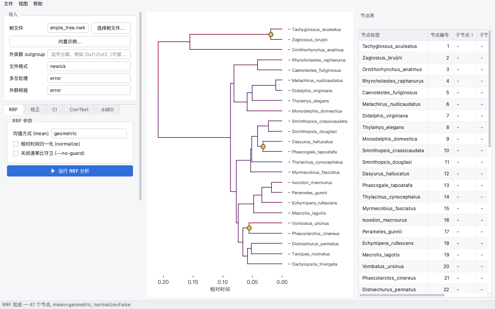
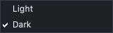
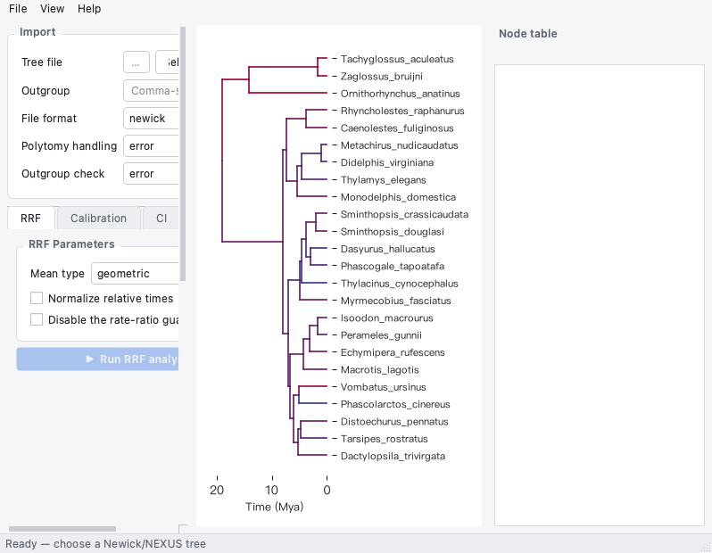
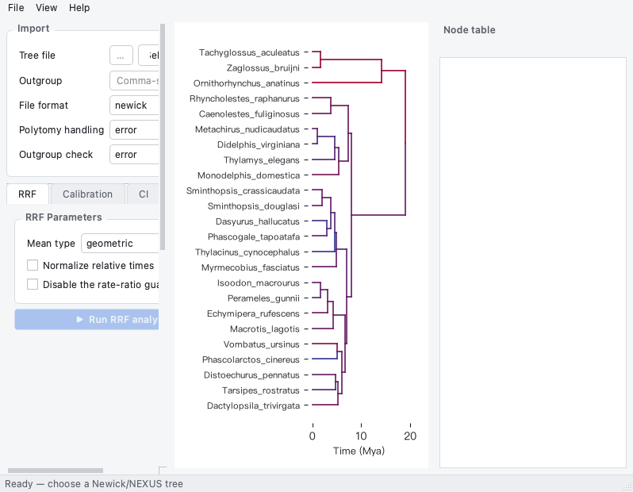
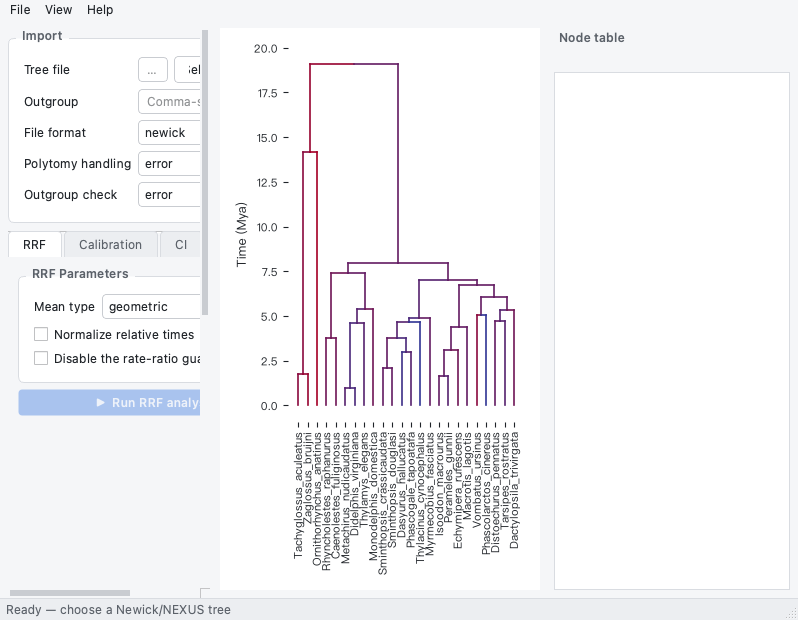
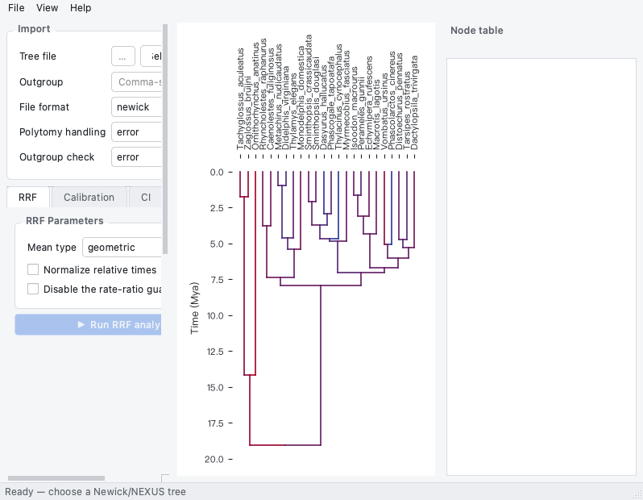

# OpenRelTime Studio 用户手册

**语言：中文** · [English](usage-en.md)

版本 0.1.0 · 环境：Python ≥ 3.10 · 许可：GPL-3.0-or-later

本手册覆盖安装、启动、窗口布局、语言与主题切换、完整分析流程、结果与导出
行为、引擎警告与取消、故障排查，以及开发者说明。英文对应版本为
[usage-en.md](usage-en.md)。参数语义、算法原理与验证说明属于引擎文档，
见 OpenRelTime 主页 <https://github.com/ZengZichao/OpenRelTime/tree/main/docs>。

---

## 目录

1. [OpenRelTime Studio 是什么](#1-openreltime-studio-是什么)
2. [安装](#2-安装)
3. [启动](#3-启动)
4. [界面总览](#4-界面总览)
5. [语言、主题与图标](#5-语言主题与图标)
6. [分步操作流程](#6-分步操作流程)
7. [结果与导出](#7-结果与导出)
8. [引擎警告、进度与取消](#8-引擎警告进度与取消)
9. [故障排查与常见问题](#9-故障排查与常见问题)
10. [开发者须知](#10-开发者须知)

---

## 1. OpenRelTime Studio 是什么

OpenRelTime Studio 是一个**原生桌面应用程序**（基于 PySide6，不依赖浏览器），
用于相对率分子定年。它面向**不写代码的研究者**：选择树文件、填写表单、在树上
点击节点设置校正点、导出可复现的结果——全程不需要打开终端。

Studio 提供的功能：

| 模块 | 为你做什么 |
| --- | --- |
| **RRF** | 从 Newick/NEXUS 树计算相对进化速率与相对分歧时间 |
| **校正** | 通过点击树上的节点、或从 TSV 文件载入校正点，把相对时间换算为绝对时间 |
| **CI** | 节点年龄的解析置信区间，以误差棒图呈现 |
| **CorrTest** | 全树速率自相关检验（CorrScore、P 值区间、ρ_s 与 ρ_ad 及其衰减） |
| **ddBD** | 密度依赖出生–死亡分化树先验，以拟合密度图呈现 |
| **导出** | CSV / NEXUS / JSON / PNG，外加可重放的等效 CLI 脚本 `run_reltime.sh` |

### 1.1 所有计算都由引擎完成

Studio **不含任何算法**。界面上出现的每一个数字都由已安装的 `openreltime`
发行版通过其公共 Python API（`read_tree`、`rrf_rates_times`、`rrf_times`、
`calibrate`、`confidence_interval`、`corrtest`、`ddbd`）产生，而这些调用只发生
在一个地方：适配层 `openreltime_studio/adapters/openreltime_adapter.py`。
任何分析函数都不会从部件或主窗口里被直接调用——这些模块只导入引擎的*结果
类*（用于类型判断，以及「关于」对话框里的版本号一行）；后台线程
`openreltime_studio/workers/analysis_workers.py` 经由适配层访问引擎，并运行在
`QThread` 中，因此界面不会卡死。

两点对你重要的推论：

* **结果与命令行一致。** Studio 与 `openreltime` 命令行在同一批输入上跑的是
  同一份代码，所以图形界面里完成的分析可以在集群上精确复现（见 §7.4）。
* **引擎是已安装的依赖，不是拷贝。** `openreltime` 是 `pyproject.toml` 中声明
  的依赖项，连同 `openreltime[plot]`（matplotlib）一起从包索引安装。Studio
  不携带引擎源码的任何副本。若引擎改动了公共 API，需要跟进的只有适配层这一处。

引擎主页：<https://github.com/ZengZichao/OpenRelTime>。

### 1.2 界面、语言与外观

* 双语界面（English / 简体中文），即时切换（§5.1）。
* 浅色 / 深色主题，即时切换（§5.2）。
* 随包分发的矢量应用图标（§5.5）。
* 许可为 GPL-3.0-or-later，与引擎一致。

---

## 2. 安装

### 2.1 从 Release 安装

Studio 与引擎目前都未发布到包索引，因此有两条安装路径：macOS 的免安装包，
或者两个 wheel。

**macOS，无需 Python。** 下载并解压
[`OpenRelTimeStudio-v0.1.0-macOS-arm64.zip`](https://github.com/ZengZichao/OpenRelTime-Studio/releases/tag/v0.1.0)，
把 `OpenRelTimeStudio.app` 拖进「应用程序」即可。该包只做了本机 ad-hoc 签名、
未经 Apple 公证，所以首次启动可能需要右键 →「打开」来越过 Gatekeeper。

**任意平台，用 wheel。** 一条命令装两个，pip 会照常从包索引解析它们的依赖
（numpy、scipy、pandas、click、matplotlib、PySide6）：

```bash
pip install \
  "openreltime[plot] @ https://github.com/ZengZichao/OpenRelTime/releases/download/v0.1.0/openreltime-0.1.0-py3-none-any.whl" \
  "OpenRelTime-Studio @ https://github.com/ZengZichao/OpenRelTime-Studio/releases/download/v0.1.0/openreltime_studio-0.1.0-py3-none-any.whl"
```

发行包名为 `OpenRelTime-Studio`，导入名为 `openreltime_studio`。两个运行时依赖：

| 依赖 | 声明的版本要求 | 作用 |
| --- | --- | --- |
| `openreltime[plot]` | `>=0.1.0` | 分析引擎，外加其绘图扩展（matplotlib） |
| `PySide6` | `>=6.5` | 提供窗口、部件与 SVG 图标渲染的 Qt 绑定 |

在 conda/micromamba 环境中，先激活目标环境，并优先使用 `python -m pip`，
以确保包装进该环境：

```bash
micromamba activate <你的环境>       # 或：conda activate <你的环境>
python -m pip install \
  "openreltime[plot] @ https://github.com/ZengZichao/OpenRelTime/releases/download/v0.1.0/openreltime-0.1.0-py3-none-any.whl" \
  "OpenRelTime-Studio @ https://github.com/ZengZichao/OpenRelTime-Studio/releases/download/v0.1.0/openreltime_studio-0.1.0-py3-none-any.whl"
```

`dev` extras（pytest、pytest-cov、ruff、mypy）不增加任何分析能力，只能从源码
检出获得，见 §2.4。

检查装好了什么：

```bash
python -c "import openreltime, openreltime_studio; print(openreltime.__version__)"
```

> **分发方式。** 上面两个 wheel 的 URL 固定在 **v0.1.0**；升级时请两处一起改，
> 因为分析行为属于引擎。发布到包索引后会在此处公告。无论走哪条路径，依赖声明都
> 一样：Studio 需要的是 `openreltime` 这个**发行版**，而不是引擎源码树的副本
> 或路径。

### 2.2 锁定引擎版本

分析行为由引擎决定，因此需要长期复现的课题应当记录用的是哪个引擎。Release 的
URL 已经替你锁好了：上面两种安装方式都显式写明了 `v0.1.0`，重复执行就得到同一
组合。

要只升级引擎而不动 Studio，就把同一个参数指向新版本的 Release：

```bash
python -m pip install --upgrade \
  "openreltime[plot] @ https://github.com/ZengZichao/OpenRelTime/releases/download/v0.1.0/openreltime-0.1.0-py3-none-any.whl"
```

请把两个版本号与结果放在一起记录；`docs/usage-zh.md` §7 说明了每次运行写出的
内容。

### 2.3 支持的平台与 Python 版本

严格按 `pyproject.toml` 中的声明：

| 项目 | 声明内容 |
| --- | --- |
| Python | `requires-python = ">=3.10"`；classifiers 列出 3.10、3.11、3.12、3.13 |
| 桌面平台 | classifiers `Environment :: MacOS X` 与 `Environment :: Win32 (MS Windows)` |
| 开发状态 | `Development Status :: 4 - Beta` |
| 许可 | `GPL-3.0-or-later` |

**已声明的桌面目标平台是 macOS 与 Windows。** 项目未声明任何 Linux 平台
classifier，因此 Linux 不属于对外声明的目标——尽管 CI 工作流确实在
`ubuntu-latest` 与 `macos-latest` 上、覆盖 Python 3.10–3.13 无头运行测试套件，
而且画布的字体回退链里包含一个 Linux 中文字体。Studio 自身不含编译扩展代码，
以纯 Python 轮子安装；一次安装的下载体量主要来自它拉取的 PySide6 轮子，而不是
Studio 本身。

### 2.3.1 校验打包结果

不用开窗口就能检查 wheel 或冻结产物：

```bash
openreltime-studio --self-check
```

它会确认中英文目录、内置示例文件、两个图标变体都能在**已安装的包内**解析到；
有任何缺失就以 `FAIL <什么>` 打印并非零退出——判断 `.app` 有没有把资源打进去
最快的办法就是它。

### 2.4 从源码安装

```bash
git clone https://github.com/ZengZichao/OpenRelTime-Studio.git
cd OpenRelTime-Studio
python -m pip install "openreltime[plot] @ https://github.com/ZengZichao/OpenRelTime/releases/download/v0.1.0/openreltime-0.1.0-py3-none-any.whl"
python -m pip install -e ".[dev]"
```

检出仍然需要引擎作为一个**已安装的发行版**，在包索引发布之前就只能用 Release
的 wheel，所以要先装引擎再装 Studio。

### 2.5 构建独立应用（可选）

每个 Release 都已附有一份预构建的应用包（见 §2.1）。要自己构建——双击即用的
macOS 应用，最终用户无需安装 Python——就用包内附带的 PyInstaller spec：

```bash
python -m pip install -e .
python -m pip install pyinstaller
pyinstaller openreltime_studio/resources/OpenRelTimeStudio.spec
```

产物为 `dist/OpenRelTimeStudio.app`；`dist/` 是构建输出，不纳入版本管理，应用包
以 Release 附件的形式发布。该 spec 会把双语消息目录、SVG 图标与内置
示例（`openreltime_studio/examples/`：`example_tree.nwk`、
`example_calibrations.tsv` 及其 `README.md`）打进包内——三者都在运行时从包内
读取——同时强制 `console=False`，并设置包标识符 `org.openreltime.studio`。
因为示例随包进入应用，冻结打包的 `.app` 里「文件 ▸ 打开内置示例…」与源码
安装版一样可用（见 §3.4）。

---

## 3. 启动

### 3.1 控制台脚本

`pyproject.toml` 声明的控制台脚本是

```text
openreltime-studio = "openreltime_studio:main"
```

因此按 §2 任一种方式安装后，用下面的命令启动：

```bash
openreltime-studio
```

### 3.2 模块方式启动

如果脚本目录不在你的 `PATH` 上，可以把包作为模块运行：

```bash
python -m openreltime_studio
```

两种形式都调用 `openreltime_studio.main.main()`，打开同一个窗口。

### 3.3 启动后你会看到什么

* 标题为 **OpenRelTime Studio** 的窗口，默认 1280 × 800 像素；或者恢复到你
  上次关闭时的大小与位置（保存在偏好键 `geometry` 与 `window_state` 里）。
* 上一次会话选择的语言与主题；**首次启动为英文 + 浅色**（§5.3）。
* 状态栏显示 **就绪 — 请选择一棵 Newick/NEXUS 树**。
* 画布为空白，中央写着「载入一棵树（或打开内置示例）后，着色的时间树会显示在这里」。
* 所有 **▶ 运行** 按钮都是灰的——满足前置条件后逐个解锁（§6.1）。

窗口出现之前，入口函数还会把 matplotlib 后端设为 `Agg`（离屏绘制再贴进 Qt
画布）、强制使用 **Fusion** 控件风格、设置 10 pt 的全局字体、套用主题的样式表
与调色板，并给引擎的 `openreltime` logger 挂上一个日志处理器，使引擎告警进入
窗口内的警告面板（§8.1），而不是你根本没有的控制台。

计算进行中关闭窗口会先询问：**计算进行中**，正文为「后台仍有计算任务，退出将中断计算。确定退出？」——默认答案是 **No**。

### 3.4 第一次启动：先跑内置示例

Studio 随包带了一棵示例树，让你不必先去找数据就能把整条流程走一遍。
**文件 ▸ 打开内置示例…**（`Ctrl+I`），或树文件那一行下方的 **内置示例…** 按钮，
一次载入一棵 24 尖的有袋类 + 单孔类年代树**以及**三条演示校正点。



载入后你应该看到：

* 文件框里显示随包的 `example_tree.nwk`——它位于已安装的包内，由
  `openreltime_studio.examples` 解析路径，而不是写死在界面上，因此冻结打包的
  `.app` 里同样能取到；
* **校正** 标签页里已经放着三条校正点，每条都写成 `taxon_set`（两个尖标签构成的
  完整单系群），所以无论节点编号如何变化都仍然有效；
* **▶ 运行 RRF 分析** 已解锁；跑完之后树就画出来、节点表也填满了，如上图。

> 示例里的校正边界是**演示用的假想数值**，为了让演示必定收敛而特意选成互相自洽，
> **不是**已发表的定年结论，也不要引用——详见
> `openreltime_studio/examples/README.md`。

---

## 4. 界面总览

### 4.1 三个窗格

窗口主体是一个水平分隔器，包含三个可调宽度的窗格（默认宽度
360 / 560 / 360 像素），分隔器下方是状态栏。拖动分隔条即可重新分配宽度；
各窗格都有最小宽度，不能被压到零。

| 窗格 | 内容 |
| --- | --- |
| 左侧 | **导入** 分组、五个分析标签页、**导出** 分组、引擎警告按钮、**等效命令行（可复现）** 分组。整列可以滚动。 |
| 中央 | 可交互的树画布。 |
| 右侧 | **节点表**，其上方有一行摘要。 |

### 4.2 左侧窗格

**导入** 分组——读取树文件时使用的设置：

| 行 | 界面标签 | 控件 |
| --- | --- | --- |
| 1 | 树文件 | 只读路径框（占位文本「尚未选择树文件」）+ **选择树文件…** 按钮（提示：「选择 Newick / NEXUS 树文件（Ctrl+O）」）；**内置示例…** 按钮独占其下方一行（提示：「载入随软件发行的 24 尖示例树与 3 条演示校正点（Ctrl+I），无需自备数据即可走完全流程」） |
| 2 | 外类群 outgroup | 文本框，占位文本「逗号分隔，例如 Out1,Out2（可留空）」 |
| 3 | 文件格式 | `newick` / `nexus` |
| 4 | 多岔处理 | `error` / `random` |
| 5 | 外群校验 | `error` / `warn` |

其下是固定顺序的五个标签页：**RRF**、**校正**、**CI**、**CorrTest**、**ddBD**。
每个标签页包含自己的参数面板，底部有一个强调色的 **▶ 运行 …** 按钮；
**校正** 标签页还包含校正点编辑器和 **从 TSV 加载校正点…** 按钮。

再往下：

* **导出** 分组里的 **导出结果…** 按钮（提示：「导出 CSV / NEXUS / JSON / PNG
  与等效 CLI 脚本（Ctrl+E）」）。
* 引擎警告按钮，在引擎产生过告警之前是隐藏的（§8.1）。
* **等效命令行（可复现）** 分组：只读的等宽文本框显示等效 CLI 命令，下面是
  **复制 CLI** 按钮（§7.4）。

### 4.3 中央：树画布

画布绘制最近一次分析所产生的视图（§6）；任何分析都没跑过时显示空态提示。

| 视图 | 绘制内容 | 轴标签 |
| --- | --- | --- |
| 时间树（RRF 或校正之后） | 矩形分支树；枝干按速率着色 | RRF 后为「相对时间」，校正后为「时间（百万年）」 |
| 置信区间（CI 之后） | 误差棒，按时间从老到新排列 | 「分歧时间」 |
| ddBD（ddBD 之后） | 节点时间直方图，叠加拟合的出生–死亡密度曲线 | 「节点时间」/「密度」 |

时间树的颜色含义：

| 元素 | 含义 |
| --- | --- |
| 枝干颜色 | 该节点的速率，映射到主题 `rate_low` → `rate_high` 之间构造的 10 档色带。浅色主题下最慢速率偏暗红、最快速率偏深蓝；深色主题下色带从橘红走到浅蓝，以便在近黑画布上保持可读。 |
| 颜色统一的蓝灰色枝干 | 关闭了速率着色（**视图 ▸ 显示速率着色** 取消勾选），或所有节点速率相同 |
| 带深色描边的黄色圆点 | 该节点上挂着校正点 |
| 散点 + 水平棒（CI 视图） | 点估计及其置信区间；散点与误差棒分别取自主题的 CI 令牌，因此在浅色/深色之间换色但仍可区分 |
| 直方图上的拟合曲线（ddBD 视图） | 观测节点时间分布上拟合出的出生–死亡密度；曲线颜色取自 `fitted_line` 令牌（浅色主题暗红，深色主题浅橘） |

交互方式：

* **点击** 任一内部节点 → Studio 跳到 **校正** 标签页，并把该节点设为校正目标
  （§6.4）。只有内部节点参与命中判定，命中半径为 10 像素，因此点击尖或空白处
  没有任何反应。
* **悬停** 内部节点 → 状态栏显示节点说明 `节点 {node_id}`，若该节点有尖标签
  则扩展为 `节点 {node_id}（{tips}）`（最多列出三个，更多时以省略号收尾），
  并附上它的时间与速率。悬停文本不会覆盖正在运行的进度消息。
* 尖标签字号随树的规模自动缩小，因此大树不会互相压字。

切换语言或主题时画布会重绘，当前结果不丢失。

### 4.4 右侧：节点表

**节点表** 标题下是逐节点结果的只读表格（§7.1），表格上方一行摘要同时承载
CorrTest 与 ddBD 的结果（这两类分析不填表）。行底色交替，选中行高亮，数值列
右对齐，表格不提供排序。

### 4.5 状态栏

一行文字，报告发生了什么、正在发生什么（§6）：读文件、分析运行中、分析完成
及其关键数值、失败原因、导出目录、命令已复制。动态消息在切换语言时会被重放，
所以状态栏的措辞也会立刻跟着变。

### 4.6 菜单与快捷键

| 菜单 | 项目 | 快捷键 / 状态 |
| --- | --- | --- |
| **文件** | 打开树文件… | Ctrl+O |
| **文件** | 打开内置示例… | Ctrl+I |
| **文件** | 导出结果… | Ctrl+E |
| **文件** | 退出 | Ctrl+Q |
| **视图** | 显示速率着色 | 可勾选，默认**勾选** |
| **视图** | 语言 ▸ | 单选：`English`、`简体中文` |
| **视图** | 主题 ▸ | 单选：**浅色** / **深色** |
| **视图** | 根节点方向 ▸ | 四选一：**根在左**（默认）/ 根在右 / 根在上 / 根在下 |
| **帮助** | 关于 OpenRelTime Studio | — |

「关于」对话框开头一行是 `OpenRelTime Studio v{version}（引擎 v{engine}）`——
分别给出 Studio 自身的版本与已安装的 `openreltime` 发行版版本，其后是所支持分析的
摘要，并说明所有计算都调用 OpenRelTime 的 Python API。

### 4.7 截图

下面给出 §5 所述四种组合的界面截图，全部由本版本程序截取。

| 英文 · 浅色 | 英文 · 深色 |
| --- | --- |
|  |  |

| 简体中文 · 浅色 | 简体中文 · 深色 |
| --- | --- |
|  |  |

---

## 5. 语言、主题与图标

### 5.1 切换语言

**视图 ▸ 语言** 提供两个单选项：`English` 与 `简体中文`。两项都用该语言自身
的文字书写——这是有意设计，无论你当前处于哪种语言，都能认出要选的那一项。

切换是**即时的，不需要重启**。选择语言后：

* 所有通过 `bind_text`、`bind_tooltip`、`bind_placeholder`、
  `bind(..., "setTitle", ...)` 登记的控件都会按其消息键重新赋值——菜单、标签页
  标题、分组框标题、按钮、标签、悬停提示和输入框占位文本；
* 动态文本会用它当初的**键与参数**重新渲染，因此状态栏消息、节点表摘要行、
  引擎警告徽标、等效 CLI 面板、校正提示行，乃至进度对话框的「取消」按钮都会
  就地换词；
* 节点表与校正点表的表头重新翻译；
* 画布重绘，坐标轴标签和空态提示跟着换语言。

不会重跑任何分析，也不会丢结果。你自己输入的文字（树路径、外类群名称）保持
不动，表里的数据同样不动。

两个子菜单的实际样子：

| 「视图」菜单（中文） | 语言子菜单（两项各以本语言书写，两种界面下都一样） |
| --- | --- |
|  |  |

### 5.2 切换主题

**视图 ▸ 主题** 提供 **浅色** / **深色**。切换时用所选的一套颜色令牌重建应用
样式表，并替换 Qt 调色板，然后通知所有自绘控件。树画布在绘制当下重新取色并
重画当前视图，于是速率着色、校正点标记、CI 误差棒和 ddBD 密度图在暗色画布上
依然可读，而不会留下一块白底。同样是即时生效，不重启，不重跑分析。

全部颜色集中在 `openreltime_studio/themes.py` 的 `LIGHT` / `DARK` 两套令牌表里。
部件不写死颜色，这正是两套主题都能完整覆盖界面的原因。

| 主题子菜单（当前为深色；此图取自英文界面，中文界面下两项为「浅色」「深色」） |
| --- |
|  |

### 5.3 哪些选择会被记住

两项设置都通过 Qt 偏好设置持久化，组织名 `OpenRelTime`、应用名 `Studio`
（即 `QSettings("OpenRelTime", "Studio")`），键为 `ui/language` 与 `ui/theme`。
它们在构造窗口之前被读取，因此第二次启动就回到你上次离开时的语言与主题。

**首次启动默认英文 + 浅色**（`DEFAULT_LANGUAGE = "en"`、
`DEFAULT_THEME = "light"`）；若存储值缺失或无法识别，同样回落到该默认值。
此外还会记住：上次选树文件的目录、上次校正文件的目录、上次导出的目录，以及
窗口几何信息。重置方法见 §9.2。

### 5.4 哪些内容不翻译

* 节点表与校正点表里的*数值*：尖标签、节点编号、密度名称、数字。单元格内容
  永不翻译。
* Studio 目录未收录的引擎列名——较新版本引擎新增的列按其原始列名显示，不做
  猜测。
* 语言子菜单的选项文字（见 §5.1）。
* 状态消息里的分析标识（`bounds`、`effective`、`geometric`、`binary`）保留为
  技术标识符，不翻译。

### 5.5 应用图标

图标是画出来的，不是剪贴画：深靛蓝底板上，一棵年代树从左向右舒展——根在左侧，
枝条在一个套着琥珀色圆环的节点上分叉（那正是你在树上点选的校正点），两个子支
上冷下暖地分色，说的就是软件在做的事：沿分支估计演化速率。尖后方几道淡淡的同心
弧是等时线，也就是被弯进树里的时间轴。包内带两个矢量变体：

| | |
| --- | --- |
|  | `OpenRelTime-Studio.svg` —— 65 px 及以上使用 |
| `OpenRelTime-Studio-symbolic.svg` | 简化版（描边加粗、只留两支与校正环、去掉等时线弧与渐变）—— 64 px 及以下使用，因为主图在这个尺度会糊成一团 |

`appicon.py` 按目标尺寸挑选变体，再通过 `QtSvg` 栅格化为多尺寸 `QIcon`
（16、24、32、48、64、128、256、512 像素），用于窗口标题栏、任务栏与 macOS
Dock。若 `QtSvg` 不可用，则退回用 `QPainter` 按同一套几何手工绘制，因此图标
不会是单一大图放大出来的模糊位图。

与它并排的 `.png` 与 `.icns` 只是**派生产物**，供打包器与安装器使用；改完 SVG
后用下面命令重新生成：

```bash
python openreltime_studio/resources/make_icon.py
```

（`icon.icns` 只在 macOS 上生成，依赖系统自带的 `sips` / `iconutil`。）

---

### 5.6 根节点方向（树的朝向）

**视图 ▸ 根节点方向** 可以选择根摆放的位置：`根在左`（默认）、`根在右`、
`根在上`、`根在下`。切换后立即作用于当前树上的图，**不需要重跑分析**，选择会
记在 `ui/root_position` 设置项里。

| 根在左（默认） | 根在右 |
| --- | --- |
|  |  |

| 根在上 | 根在下 |
| --- | --- |
|  |  |

两件事会随朝向自动跟上：

* **翻转的是时间轴，不是数值。** 分歧时间存的是「距今年龄」（尖为 0，根最老），
  所以「根在左」是把最老的时刻挪到左边缘，每个刻度读数仍然是真实值。
* **尖标签始终贴着尖**——「根在左」放在右轴，「根在右」放在左轴，「根在上」竖排
  在底轴（旋转 90°），「根在下」放在顶轴。

尖的顺序永远与节点表一致：水平朝向时第一个尖在最上方，竖直朝向时第一个尖在最左方。


## 6. 分步操作流程

### 6.1 总体流程与各按钮的解锁条件

```text
打开树 →（RRF 页）运行 RRF →（校正页）添加校正点 → 运行校正
        →（CI 页）运行置信区间 →（CorrTest / ddBD 页）按需运行
        → 导出结果…
```

每个运行按钮初始都是禁用状态，其可用性只由一条规则决定，且集中在一处计算
（`_refresh_actions`）：

| 按钮 | 何时可用 |
| --- | --- |
| **▶  运行 RRF 分析** | 已载入树且没有任务在跑 |
| **▶  运行校正** | 已存在 RRF 结果且没有任务在跑 |
| **▶  运行置信区间** | 已存在校正后结果且没有任务在跑 |
| **▶  运行 CorrTest** | 已载入树且没有任务在跑 |
| **▶  运行 ddBD** | 已载入树且没有任务在跑 |
| **导出结果…** | 至少存在一种结果且没有任务在跑 |
| **选择树文件…** / **内置示例…** / **从 TSV 加载校正点…** | 没有任务在跑 |

CorrTest 与 ddBD 只需要树，因此可以在任何定年之前——或替代定年——直接运行。
只要有任务在跑，鼠标就变成等待光标，并禁用上面这些入口，所以实际行为是同一
时刻只跑一个分析。

载入**另一棵树**会丢弃全部结果、全部校正点、画布内容、表格内容以及等效 CLI
命令。这是有意为之：校正点绑定的是它们被创建时那棵树的节点编号，若悄悄套用
到新拓扑上命中的会是完全不同的支系。重跑 **RRF** 会保留你的校正点，但会使
校正、CI、CorrTest、ddBD 结果失效（它们依赖旧的 RRF 结果）。

某次运行失败时，它会在以该阶段命名的对话框里报告引擎的消息——**RRF 分析失败**、
**校正失败**、**CI 分析失败**、**CorrTest 失败**、**ddBD 失败**——状态栏同步显示
对应的短消息（「RRF 分析失败」「校正失败」……）。失败的运行不会改动已存的结果，
画布与表格因此仍显示上一次成功的输出。

### 6.2 第 1 步 —— 打开 Newick/NEXUS 树

1. **文件 ▸ 打开树文件…**（Ctrl+O），或点 **选择树文件…** 按钮。
2. 选中文件。选择器标题为「选择系统树」，过滤器是「树文件 (\*.nwk \*.newick
   \*.nex \*.nexus)」，其后跟着「所有文件 (\*)」。路径显示在只读框里，该目录会被记住。
3. 按需填写 **导入** 分组各行（见下面的表格）。
4. 树在后台解析；状态栏先显示「读取树文件中…」，成功后显示按下面模板生成的
   一行：

```text
已载入：{name} — {tips} tips, {internal} internal nodes, {tree_kind}
```

其中 `{tree_kind}` 为 `binary` 或 `non-binary`。解析失败时弹出 **读取失败**
对话框并附上引擎的消息，状态栏显示「读取失败」；其他内容一律不作废，你可以
改正设置后重试。

**外类群 outgroup** —— 逗号分隔的尖名称，例如
`Ornithorhynchus_anatinus`，或 `Tachyglossus_aculeatus,Zaglossus_bruijni`。
留空则不向引擎传外类群：树按你载入的样子分析，沿用文件自带的根基位置。

**文件格式** —— `newick` 或 `nexus`。选文件时按扩展名自动判定（`.nex` /
`.nexus` → nexus，其余 → newick）。若扩展名与内容不符（例如 NEXUS 内容存成了
`.txt`），把下拉框改成真实格式即可：当前文件会立刻按新格式重读，并且在你改过
之后，扩展名检测不会再覆盖你的手动选择，直到你另选一个文件。

**多岔处理** —— `error`（默认）拒绝含未解决多岔节点的树；`random` 把每个多岔
节点随机二分化。

**外群校验** —— 当多尖外群*不是*一个完整单系群时的处理方式：`error`（默认）
中止读取，`warn` 仅告警。单尖外群总是完整的，不做校验。

> **重要。** 外类群、多岔处理与外群校验都是在读取树文件的那一刻生效的。修改
> 它们**不会**自动替你重载树——改完后请重新打开树文件（Ctrl+O）使其生效。
> （**文件格式**是唯一会立即重读的，因为格式错了当前文件根本读不进来。）

### 6.3 第 2 步 —— 运行 RRF

打开 **RRF** 标签页，**RRF 参数** 面板收集以下设置：

| 控件 | 界面标签 | 取值 | 默认值 | 含义 |
| --- | --- | --- | --- | --- |
| 下拉框 | 均值方式 (mean) | `geometric`、`arithmetic` | `geometric` | 相对速率比较采用哪种均值 |
| 复选框 | 相对时间归一化 (normalize) | 开/关 | 关 | 是否对得到的相对时间做归一化 |
| 复选框 | 关闭速率比守卫 (--no-guard) | 开/关 | 关（守卫**开启**） | 守卫会把速率比超过阈值的节点时间替换为祖先时间；悬停提示：「勾选后不将超出阈值倍率的节点时间替换为祖先时间（默认开启守卫，阈值 20）」。守卫开启时 Studio 向引擎传阈值 **20**，勾选该框则不传阈值以关闭守卫 |

点 **▶  运行 RRF 分析**。状态栏「RRF 计算中…」→

```text
RRF 完成 — {nodes} 个节点, mean={mean}, normalize={normalize}
```

画布画出按速率着色的相对时间树（横轴「相对时间」），节点表填入逐节点速率与
时间。失败时弹出 **RRF 分析失败** 对话框，状态栏显示「RRF 分析失败」。

### 6.4 第 3 步 —— 添加校正点

校正点需要 RRF 结果，所以先完成 §6.3（标签页与编辑器随时可用，但
**▶  运行校正** 一直是灰的）。

#### 6.4.1 在树上点击节点

切到 **校正** 标签页，然后在画布上点击一个内部节点。标签页会自动切过来，
编辑器填入目标节点，提示行按模板显示：

```text
已选中 Node {node_id}，填写 Min/Max 后点击「添加校正点」
```

在你点击之前，提示行是「在树上点击内部节点以添加校正点」，目标节点栏显示
「（请在树上点击节点）」，且 **添加校正点** 按钮在选中节点前始终禁用。

在 **添加 / 编辑校正点** 分组里：

| 字段 | 界面标签 | 行为 |
| --- | --- | --- |
| 目标节点 | 目标节点: | 显示你点击的节点 `Node {id}` |
| 下界 | 设定下界 | 必须勾选该复选框，这个界才会被使用；数值框范围 1e-06 … 1e9、6 位小数，未勾选时禁用。提示：「校正下界（Mya）」 |
| 上界 | 设定上界 | 同样的结构，提示「校正上界（Mya）」 |
| 密度 | 密度类型: | `(none)`、`uniform`、`exponential`、`normal`、`lognormal`；`(none)` 表示「不使用密度」 |
| 密度参数 | 密度参数: | `key=value;...` 形式，留空即用引擎默认值。占位文本「key=value;...（留空用默认），如 offset=60;mean=20」；提示列出各密度的参数键：「uniform: min,max / exponential: offset,mean / normal: mean,sd / lognormal: offset,meanlog,sdlog」 |

点 **添加校正点**。校正点被追加到表格里，表格列为
Node ID / Min / Max / Density / **操作**（操作列里放 **删除** 按钮），画布上对应
节点出现黄色标记，编辑器为下一次点选复位，并提示：

```text
已添加 Node {node_id} 的校正点，可继续点选其他节点
```

需要注意：

* 未勾选的界存为「未设定」，表格中显示为 `-`；而真正取值为 `0` 的界仍显示为
  `0`，不会被显示成 `-`。
* 对已经设过校正的节点再次添加会**替换**旧值（一个节点只保留一条），提示行
  变成「已替换 Node … 的校正点，可继续点选其他节点」。
* 输入不合法会在点击时就拦下，弹出 **无效校正** 对话框并说明问题（§9.1）；
  密度参数写错格式则弹出 **无效密度参数**。
* **清空全部** 会弹出 **清空校正点** 确认框，其中写明数量：「确定删除全部 {count} 个校正点？」
* 行末的 **删除** 只移除该条校正点及其标记；按钮提示里写明目标。
* 目标以分类单元集合而非节点编号给出的校正，在 Node ID 列显示这些名称，
  提示为「按 taxon_set 的 MRCA 定位目标节点」。

#### 6.4.2 从 TSV 文件加载

点 **从 TSV 加载校正点…** 打开标题为「选择校正点文件」的选择器（过滤器「校正点文件
(\*.tsv)」）并选中文件。文件必须使用引擎的校正表格式——制表符分隔，表头为

```text
node_id	taxon_set	min_bound	max_bound	density	density_params
```

空字段用 `.` 表示；Studio 在导出（§7.3）时写出的正是这个形状，所以在图形界面
里做的一轮设置之后可以重新载入并按命令行重放。

加载会**整体替换**当前列表。随后每一行都按已载入的树校验：

* 能定位到内部节点的行被保留；
* 不能定位的行被丢弃，并在 **校正点校验** 对话框里逐条列出：「以下校正点不属于
  当前树的内部节点，已移除：」；
* 只给出 taxon_set 的行会被**保留**——由引擎按其 MRCA 定位，所以这是合法输入，
  不是错误；
* 文件读不进来会报 **加载校正点失败**。

状态栏最后显示「已加载校正点：{name}（{count} 条）」，并且该文件被记为列表的
来源，等效 CLI 脚本因此可以引用它（§7.4）。加载之后再手工改动列表，就会取消
这个来源声明。

#### 6.4.3 校正参数

**校正** 标签页其余部分是 **校正参数** 面板：

| 控件 | 界面标签 | 取值 | 默认值 | 含义 |
| --- | --- | --- | --- | --- |
| 下拉框 | 方法 (method) | `bounds`、`effective` | `bounds` | 用哪种方式求解全局时间因子 |
| 数值框 | 有效重复次数 (n_effective) | 2 … 100000 | 10000 | `effective` 方法的重复次数；仅当方法为 `effective` 时可用 |
| 复选框 | 固定种子 | 开/关 | 关 | 不勾选就不传 `seed`，该次运行不可复现 |
| 数值框 | 随机种子 | 0 … 2147483647 | 42 | 仅在 `effective` **且**勾选「固定种子」时可用 |

运行按钮上还挂着提醒提示：「需要先运行 RRF 分析，并添加至少一个校正点」。

### 6.5 第 4 步 —— 运行校正

点 **▶  运行校正**。在真正计算之前会复核每一条校正点（规则见 §9.1）：只要有
不合法的，就弹出 **校正点无效** 对话框逐条列出，状态栏显示「校正点无效，未运行
校正」，求解器不会被调用。若列表为空，则弹出 **提示** 对话框「请添加至少一个校正点」。

否则会出现模态进度对话框（§8.2、§8.3），成功后：

```text
校正完成 — method={method}, f={factor}, {count} 个校正点
```

* 画布改用**绝对时间**重绘（横轴「时间（百万年）」）；
* 被校正的节点获得黄色标记；
* 节点表重新填入绝对时间与速率；
* 表格上方那行摘要显示同一句话，如果校正结果自带告警，还会追加
  `  ⚠ {count} 条告警`。

Studio 同时会把溯源信息写进结果报告——树文件路径、校正文件、外类群、格式、
多岔处理与外群校验设置——使得之后针对导出报告运行 `openreltime ci` 时能找回
原始输入。重跑校正会清空既有 CI 结果（以及对应的 CLI 命令），因为它基于上一轮
校正。

### 6.6 第 5 步 —— 运行置信区间

打开 **CI** 标签页（存在校正后结果后解锁），**置信区间参数** 面板收集：

| 控件 | 界面标签 | 取值 | 默认值 | 含义 |
| --- | --- | --- | --- | --- |
| 下拉框 | 置信水平 (level) | `0.95`、`0.90`、`0.99` | `0.95` | 区间的置信水平 |
| 复选框 | 指定位点数 (n_sites) | 开/关 | 关 | 到底是否向引擎传位点数 |
| 数值框 | n_sites 值 | 1 … 1000000000 | 1000 | Poisson 近似 `vS(b) = b / L` 中的序列长度 `L`；下界为 1，因此勾选后不可能静默传入 0 |
| 提示文字 | （斜体提示行） | 复选框**未勾选**时显示 | 默认可见 | 「未指定位点数：vS(b)=0，区间只反映速率异质性分量（msz236 模拟协议），不含枝长抽样误差。」 |
| 输入框 + 按钮 | 逐枝抽样方差 | TSV 路径，**浏览…** | 空 | 可选地逐枝覆盖抽样方差，文件为表头 `node_id` / `var` 的 TSV（与 CLI `--branch-var` 同格式） |

点 **▶  运行置信区间**。结果：

```text
CI 完成 — level={level}, {nodes} 个节点, vS(b) 来源：{v_s_source}
```

其中 `vS(b) 来源` 告诉你引擎实际使用了哪一项逐枝方差。画布切换为误差棒视图
（按时间从老到新的 60 个节点，能取到标签的就用尖/群名标注），节点表则替换为
CI 表（§7.1）。方差文件有问题会在运行前就被拦下：**读取 branch-var 失败**
对话框，状态栏显示「读取 branch-var 失败」。

### 6.7 第 6 步 —— CorrTest

**CorrTest** 标签页只需要已载入的树，**CorrTest 参数** 面板收集：

| 控件 | 界面标签 | 取值 | 默认值 | 含义 |
| --- | --- | --- | --- | --- |
| 数值框 | 姊妹对重采样次数 | 0 … 10000 | 0 | 姊妹对分量的重采样重复数；0 表示不做 |
| 复选框 + 数值框 | 固定种子 / 随机种子 | 0 … 2147483647 | 关 / 42 | 重采样的随机种子 |
| 复选框 | 锚定节点 | 开/关 | 关 | 开启锚定，并解锁下面两个字段 |
| 数值框 | 锚定节点 ID | 1 … 1000000 | 1 | 被锚定的节点 |
| 数值框 | 锚定时间 | 0 … 1000000，6 位小数 | 1.0 | 赋给锚定节点的年龄 |

点 **▶  运行 CorrTest**。CorrTest 给出的是标量结论而非逐节点表格，所以结果
出现在节点表上方的摘要行（`CorrTest — score={score}, P={p_band}`）以及
**CorrTest 结果** 对话框里，对话框包含这些行：

```text
CorrScore = <score>
P-value band: <band>

ρ_s (sister) = <rho_s>
ρ_ad (ancestor-descendant) = <rho_ad>
ρ_ad decay (lag 2) = <lag2>
ρ_ad decay (lag 3) = <lag3>
```

### 6.8 第 7 步 —— ddBD

**ddBD** 标签页同样只需要已载入的树，**ddBD 参数** 面板收集：

| 控件 | 界面标签 | 取值 | 默认值 | 含义 |
| --- | --- | --- | --- | --- |
| 下拉框 | 选择准则 (measure) | `SSE`、`KL` | `SSE` | 所报告解是按哪个准则选出的 |
| 复选框 | 锚定节点 | 开/关 | 关 | 解锁节点 ID 与锚定时间 |
| 数值框 | 锚定节点 ID | 1 … 1000000 | 1 | 被锚定的节点 |
| 数值框 | 锚定时间 | 0 … 1000000，6 位小数 | 1.0 | 赋给锚定节点的年龄 |
| 复选框 | 固定采样比例 | 开/关 | 关 | 不勾选则不传该比例，由引擎自行估计 |
| 数值框 | 采样比例 (sampling_frac) | 0 … 1，6 位小数 | 0.5 | 谱系的保存概率 |

点 **▶  运行 ddBD**。画布切换为节点时间直方图加拟合密度曲线。如果你**还没**跑
过 RRF，Studio 会在后台安静地补算一次相对时间，仅用于出图——状态栏显示
「ddBD 完成 — 补算相对时间用于绘图…」——若这次补算失败，会告知「相对时间补算
失败，无法绘制密度图。」，但数值照常报告。**ddBD 结果** 对话框与摘要行
（`ddBD — birth={birth}, death={death}, ρ={rho}`）给出：

```text
Birth rate = <birth>
Death rate = <death>
Sampling fraction = <rho>
Scale factor = <scale>
```

---

## 7. 结果与导出

### 7.1 节点表

表格按当前结果逐节点成行。具体出现哪些列取决于引擎为该结果产生的内容；
Studio 翻译它认识的表头，其余列名按引擎原样显示。单元格*内容*永不翻译。
数值按 6 位有效数字显示，缺失值留空，数值列右对齐。

速率与时间表（RRF 或校正之后）：

| 英文表头 | 中文表头 | 内容 |
| --- | --- | --- |
| NodeLabel | 节点标签 | 尖标签或群名 |
| NodeId | 节点编号 | 校正编辑器与树画布使用的节点编号 |
| Des1 | 子节点 1 | 第一个子节点 |
| Des2 | 子节点 2 | 第二个子节点 |
| Time | 时间 | 相对时间（RRF）或以 Mya 为单位的年龄（校正后） |
| Rate | 速率 | 引擎报告的速率列 |
| RRFRate | RRF 相对速率 | RRF 层给出的相对速率 |
| ImpliedRate | 隐含速率 | 隐含速率 |

置信区间表（CI 之后）：

| 英文表头 | 中文表头 | 内容 |
| --- | --- | --- |
| Node ID | 节点编号 | 节点编号 |
| Node label | 节点标签 | 尖标签或群名 |
| Time (Mya) | 时间（Mya） | 点估计 |
| SE | 标准误 | 标准误 |
| CI lower | 置信下限 | 区间下限 |
| CI upper | 置信上限 | 区间上限 |
| CI width | 区间宽度 | 区间宽度 |
| SE reliable | SE 可靠 | 该标准误是否被认为可靠 |
| Notes | 备注 | 引擎给出的逐节点备注 |

CorrTest 与 ddBD 不填表；它们的结果在表格上方的摘要行和各自对话框里
（§6.7、§6.8）。

### 7.2 摘要行

**节点表** 标题正下方那一行承载最近一次完成分析的关键数字——措辞与那一刻状态栏
用到的完全一致——外加告警计数。因为 Studio 记住了产生它的键与参数，这一行在切换
语言后仍然保持内容并重画文字。

### 7.3 导出

**文件 ▸ 导出结果…**（Ctrl+E）、**导出结果…** 按钮、或菜单项——都走同一个流程。
若当前完全没有结果，会用 **提示** 对话框拒绝：「没有可导出的结果」。

1. 打开目录选择器（目录会被记住）。Studio 写进该目录，不再询问文件名。
2. 使用的结果是**当前标签页**对应的结果。若该标签页没有结果，Studio 退回到
   第一个可用的结果（RRF → 校正 → CI → CorrTest → ddBD）；因此通常感觉不到
   差别——但请注意，当前标签页没有结果并不等于什么都不导出。
3. 数据文件统一使用固定输出前缀 `openreltime_result` 写出——与等效 CLI 脚本
   用的是同一个前缀，两边因此对得上。引擎按被导出的结果类型写出相应的一组文件
   （CSV、适用时的 NEXUS 树，以及 JSON 报告）。对校正而言，Studio 还会在该报告里
   记下溯源信息——解析后的树文件路径、校正文件、外类群，以及格式 / 多岔 /
   外群校验设置——使得之后针对该报告运行 `openreltime ci` 能找回原始输入。
4. 写出画布当前内容的 PNG，名称跟随画布此刻显示的内容并跟随当前标签页：RRF 与
   **校正** 标签页是 `timetree.png`，其余分别是 `ci.png`、`corrtest.png`、
   `ddbd.png`——200 dpi、紧贴边界。图像导出失败绝不阻塞数据导出，只以一条注记
   报告：「图像导出失败（{error}）」。
5. 当存在校正点**并且**被导出的流水线包含校正或 CI 步骤时，写出
   `calibrations.tsv`——这样你在树上点选的校正点也能量复重放。若有校正点但导出的
   流水线里没有 calibrate 步骤，对话框会说明情况而不写出一个孤立文件：
   「校正点仅存在于界面中（等效脚本不含 calibrate 步骤），未写出
   calibrations.tsv」。
6. 存在等效命令时写出 `run_reltime.sh`，并置为可执行。

最后弹出 **导出完成** 对话框，列出每一个写出的文件及附加注记；状态栏显示
「已导出到 {directory}」。若引擎拒绝写出，则弹出 **导出失败** 并附异常文本。

### 7.4 等效 CLI 面板与可复现性

**等效命令行（可复现）** 分组会随着你的操作，显示复现刚才所做分析的准确 CLI
命令。下面是「默认设置跑一次 RRF，再按 `bounds` 方法做一次校正」的形状（树路径、
前缀与开关都取自你自己的设置）：

```text
openreltime rates-times -i "/path/to/tree.nwk" --fmt newick --resolve error --outgroup-check error --mean geometric -o openreltime_result
openreltime calibrate -i "/path/to/tree.nwk" -c "calibrations.tsv" --fmt newick --resolve error --outgroup-check error --method bounds -o openreltime_result
```

第一次分析之前，文本框里是占位提示「# 运行分析后在此显示等效 CLI 命令」，
此时 **复制 CLI** 有意什么都不做；一旦存在真实命令，**复制 CLI** 会把命令放进
剪贴板，状态栏确认「CLI 命令已复制到剪贴板」。

面板遵循的规则，全部服务于可重放：

* 命令**按阶段**保存，并按流水线顺序渲染：
  `rates-times → calibrate → ci → corrtest → ddbd`，因此一条 `ci` 绝不会在没有
  它的 `calibrate`（以及 `rates-times`）前置步骤的情况下被单独发出；
* 重跑 RRF 会从头重建整个列表，因为下游一切都已过期；重跑校正会丢弃旧的 `ci`
  命令；
* 树始终以**绝对路径**传入，读取设置（`--fmt`、`--resolve`、
  `--outgroup-check`）与 `--outgroup` 一律显式写出，即使等于默认值，以保证重放
  用的树与界面上用的是同一棵；
* `--n-effective` 只在 `effective` 方法下出现，`--seed` 只在勾选固定种子时出现；
* `run_reltime.sh` 开头是 `set -euo pipefail` 与 `cd "$(dirname "$0")"`，因为
  `calibrations.tsv` 与 `openreltime_result` 前缀都是相对脚本自身目录写出的
  ——从哪里运行它都能找到自己的输入。若没有任何可导出内容，注记会写「没有可
  导出的等效 CLI 命令，未写出 run_reltime.sh」。

由于这些命令走的正是 GUI 调用的那套引擎 API，导出的数字与重放得到的数字天然
一致。

---

## 8. 引擎警告、进度与取消

### 8.1 引擎警告面板

Studio 没有控制台，因此引擎的日志记录被收集在内存里：挂在 `openreltime`
logger 上的处理器保留最近 **500** 行，格式为
`级别 记录器名: 消息`。

* 只要至少有一条记录，左栏就会出现一个按钮，文字是 **⚠ 引擎警告（{count}）**，
  计数实时更新（为零时隐藏）。每个后台任务结束时按钮都会刷新。
* 点击后打开 **OpenRelTime 引擎警告**，其中是收集到的各行文本的只读列表，
  带一个关闭按钮；还没有任何告警时显示「（暂无警告）」。
* 计数是整个会话累计的：载入新树不会清空缓冲区，所以旧告警仍然可读（也仍被
  计数），直到你重启 Studio。
* 校正结果*内部*返回的告警是另一回事，它们出现在完成消息里，形如
  `  ⚠ {count} 条告警`。

### 8.2 进度与忙碌状态

每个分析都在后台线程里跑，窗口始终正常重绘。任务进行中，Studio 会显示等待
光标、禁用各运行按钮与选树/载入 TSV 入口（§6.1）、暂停状态栏的悬停消息，并
显示阶段消息（`RRF 计算中…`、`校正计算中…`、`置信区间计算中…`、
`CorrTest 计算中…`、`ddBD 计算中…`）。

只有校正配有进度对话框，因为只有校正可能很久：

| 方法 | 对话框文本 | 行为 |
| --- | --- | --- |
| `effective` | 「校正计算中…（effective 方法含大量重复）」 | 引擎在每一次重复完成后回报，标签更新为「校正重复 {done}/{total} …」，点**取消**可在两次重复之间终止运行 |
| `bounds` | 「校正计算中…（bounds 方法不可中断，取消将在完成后丢弃结果）」 | 不确定模式（无进度条）的对话框：求解是一次性、不可中断的步骤 |

该对话框是模态的，只在耗时超过约 300 毫秒后才弹出；它的 **取消** 按钮跟随界面
语言——即使你在计算过程中切换语言。

### 8.3 「校正已取消（结果未应用）」

按 **取消** 会发出取消请求。后续行为随方法而异，但保证是同一个：

* `effective`——引擎在下一次重复边界停下，Worker 报告被取消；
* `bounds`——求解无法中断，它会算完，**然后算完的结果被丢弃**。

两种情况下状态栏都会显示

```text
校正已取消（结果未应用）
```

数秒，而回调在*应用任何东西之前*就返回：画布、节点表、校正标记、保存的校正后
结果以及等效 CLI 面板，全部保持运行开始之前的样子。因此一次被取消的校正绝不
会把半截结果留在屏幕上——最坏情况只是白等了一会儿。

---

## 9. 故障排查与常见问题

### 9.1 导出与按钮

| 现象 | 原因与处理 |
| --- | --- |
| **导出结果…** 是灰的 | 完全没有结果。先载入树并至少跑一个分析（§6.3）。 |
| 「没有可导出的结果」 | 同样：所有结果都是空的。这通常发生在你刚载入另一棵树之后——载入新树是有意丢弃全部结果的。 |
| 明明有校正点，**▶  运行校正** 还是灰的 | 本次会话没有跑过 RRF，或还没跑完。校正消费的是 RRF 结果。 |
| **▶  运行置信区间** 是灰的 | 没有校正后结果：先完成 §6.5。 |
| 我的校正点不见了 | 载入另一棵树会使校正点作废——它们的节点编号属于上一棵树的拓扑。可以把它们导出到 `calibrations.tsv`，或保留当初载入的 TSV 再重新加载。 |
| 导出的 PNG 不是我预期的那张树图 | PNG 跟随**当前标签页**：RRF 与 **校正** 标签页保存 `timetree.png`，因此 CI 标签页激活时得到的是 `ci.png`。想要哪个视图就切到哪个标签页再导出。 |
| 导出目录里没有 `run_reltime.sh` | 当时还没有记录到任何等效命令——脚本只在至少一个阶段跑过之后才写出。导出完成对话框会明确告诉你：「没有可导出的等效 CLI 命令，未写出 run_reltime.sh」 |
| **复制 CLI** 没有反应 | 面板里仍是占位提示「# 运行分析后在此显示等效 CLI 命令」。 |
| 重跑 RRF 之后数字变了 | 属于预期：重跑 RRF 会使基于上一轮 RRF 得到的校正、CI、CorrTest、ddBD 结果全部作废。 |

### 9.2 重置偏好设置

语言、主题、记住的目录与窗口几何信息都在 Qt 偏好设置对
`QSettings("OpenRelTime", "Studio")` 下——组织名 `OpenRelTime`、应用名
`Studio`——用到的键为：`ui/language`、`ui/theme`、`last_tree_dir`、
`last_cal_dir`、`last_export_dir`、`geometry`、`window_state`。

想知道这个文件在你机器上的具体位置，并从头开始：

```bash
python -c "from PySide6.QtCore import QSettings; s=QSettings('OpenRelTime','Studio'); print(s.fileName()); s.clear()"
```

请先关闭 Studio。清空偏好不影响你的数据；下次启动回到英文 + 浅色、默认
1280 × 800 窗口。若只想删一个键，用同样写法里的 `s.remove("ui/language")`。

### 9.3 校正相关的问题

| 消息 | 触发原因 | 处理 |
| --- | --- | --- |
| 「Min / Max / Density 至少要填写一项」 | 什么都没勾、也没选密度 | 设一个界，或选一个密度 |
| 「Min 边界不能大于 Max 边界」 | min > max | 交换或放宽 |
| 「Max 边界为 0 会把全树年龄整体缩放为 0（且求解器除零），请填写一个正的年龄上限」 | 上界留在 0 | 输入正的年龄上限；不想要上界就**不要勾选**「设定上界」 |
| 「{name} 边界不能为负」/「必须是有限数值」 | 负数、NaN 或无穷 | 输入有限的非负年龄 |
| 「method=bounds 需要至少一个数值边界；纯密度校正请用 effective 方法」 | 方法为 `bounds` 却只给了密度 | 把方法改成 `effective`，或补一个数值边界 |
| 「校正点仅存在于界面中（等效脚本不含 calibrate 步骤），未写出 calibrations.tsv」（导出注记） | 有校正点，但导出的流水线里没有 calibrate/CI 步骤 | 跑一次校正；或接受这些校正点只存在于界面 |
| 「以下校正点不属于当前树的内部节点，已移除」，并伴随例如「node_id {node_id} 不在当前树中」或「node_id {node_id} 是一个尖，不能作为校正目标」 | TSV 来自另一棵树，或把尖当成了节点 | 用相匹配的树重新导出；只对内部节点设校正 |
| 「taxon_set {taxa} 无法解析」/「只对应一个尖，不是内部节点」 | 名称既不匹配尖也不是可解析的群，或该集合塌缩为一个尖 | 改正名称；一个 taxon_set 至少要覆盖两个尖 |

注意：「设定下界」/「设定上界」未勾选表示*这一界不属于该校正*，而不是
*这一界为 0*。

### 9.4 读取树的问题

| 消息 | 处理 |
| --- | --- |
| 「文件不存在或不可读：…」 | 文件被移动过，或选中了目录；重新选一次 |
| 「输入不合法：…」（解析树时） | Newick/NEXUS 格式错误、枝长为负、尖名重复 |
| 读树时报多岔错误 | 把**多岔处理**改成 `random`，然后重新打开该文件 |
| 外群不是完整单系群的错误 | 把外群名单补全；或把**外群校验**改为 `warn`，然后重新打开该文件 |
| 「节点或分类不存在：…」 | 外类群名字不是该文件里的尖标签；检查拼写 |
| 扩展名是 `.txt` 的 NEXUS 文件读不进来 | 把**文件格式**改为 `nexus`——当前文件会立刻按所选格式重读 |
| 改了外类群 / 多岔 / 外群校验却像没生效 | 这三项在读取时生效；请重新打开树文件（Ctrl+O） |

### 9.5 显示、字体与高分屏

| 问题 | 回答 |
| --- | --- |
| 图里的中文显示成方框 | 画布按这条回退链请求 CJK 字体：PingFang SC、Hiragino Sans GB（macOS）、Microsoft YaHei（Windows）、Noto Sans CJK SC、Source Han Sans SC，最后才是 DejaVu Sans。一个都没装就会出现方框。任选一个 CJK 字体装上，或把界面留在英文。 |
| Retina / 高分屏上整体偏小 | 打包出的 `.app` 声明了 `NSHighResolutionCapable`，因此按原生分辨率渲染；程序有意**不提供**任何界面内字号或 DPI 设置。把窗口开大（默认 1280 × 800），并拖动分隔条加宽左栏。 |
| 菜单和图形风格一致吗 | 一致——画布会重新读取主题令牌并重绘，所以切到深色后不会出现一块白底黑字。 |
| 树画布那格太挤 | 它的最小宽度是 320 像素，窗口变大时多出的空间优先给它；左栏是靠滚动的，不会挤压画布。 |
| 大树的尖标签互相压字 | 尖标签字号已随尖的数量自动缩小；再不够就加宽画布，或导出 PNG（200 dpi、紧贴边界）后按原始尺寸查看。 |
| macOS 提示 | Studio 有意强制使用 **Fusion** 控件风格：macOS 原生风格会忽略样式表的部分内容，那会让浅色配色残留在深色模式下。请预期看到 Fusion 外观，而不是 Aqua 外观。 |

### 9.6 通用问答

**图形界面自己算了什么吗？** 没有。速率、时间、校正、区间、CorrTest 与 ddBD
全部出自已安装的 `openreltime` 发行版的公共 API（§1.1）。Studio 只负责收集
参数、绘制结果、写出文件。

**这些数字和命令行一样吗？** 一样，前提是读取设置一致。这正是等效 CLI 脚本总是
显式写出 `--fmt`、`--resolve`、`--outgroup-check` 和绝对 `-i` 路径的原因
（§7.4）。

**能恢复上一次会话吗？** 不能直接恢复：程序没有工程文件。请重新载入树（使用
相同的 **导入** 设置）、载入 `calibrations.tsv`，再重跑。

**我的 CI 区间偏宽或偏窄是否和设置有关？** 看 CI 消息里的 `vS(b) 来源` 以及
CI 标签页上的那行提示：未指定位点数时 `vS(b) = 0`，区间只包含速率异质性分量，
也就是不含枝长抽样误差（§6.6）。

**我固定了种子但结果还是变了。** 「固定种子」默认是关的；对校正而言，它只在
`effective` 方法下才可勾选，否则种子数值框是灰的（§6.4.3）。

**参数的统计学含义在哪里查？** 参数语义与算法都写在引擎文档里：
<https://github.com/ZengZichao/OpenRelTime/tree/main/docs>。Studio 把其中一部分
以表单字段暴露出来，默认值列在 §6 各表里。

---

## 10. 开发者须知

### 10.1 仓库结构

| 路径 | 职责 |
| --- | --- |
| `openreltime_studio/main.py` | 入口：matplotlib 后端、`QApplication`、Fusion 风格、恢复主题与语言，以及日志收集器类 |
| `openreltime_studio/__main__.py` | 支持 `python -m openreltime_studio` |
| `openreltime_studio/i18n.py` | 消息目录、`bind_*` 登记、语言持久化 |
| `openreltime_studio/themes.py` | 颜色令牌、QSS 模板、`QPalette`、matplotlib rc 映射、主题持久化 |
| `openreltime_studio/appicon.py` | SVG → 多尺寸 `QIcon`，`QPainter` 回退 |
| `openreltime_studio/locales/{en,zh}/*.json` | 按命名空间划分的双语消息目录 |
| `openreltime_studio/resources/icons/OpenRelTime-Studio.svg` | 图标唯一权威来源；`make_icon.py` 由它生成 `.png` / `.icns` |
| `openreltime_studio/resources/OpenRelTimeStudio.spec` | PyInstaller 构建脚本 |
| `openreltime_studio/adapters/openreltime_adapter.py` | 唯一调用引擎的模块，同时负责生成等效 CLI 命令 |
| `openreltime_studio/workers/analysis_workers.py` | `QThread` 封装、进度回报、取消 |
| `openreltime_studio/windows/main_window.py` | 布局、菜单、对话框、状态消息、导出 |
| `openreltime_studio/widgets/` | `param_panels.py`、`calibration_editor.py`、`node_table.py`、`tree_canvas.py` |
| `openreltime_studio/tests/` | 适配层、目录、回归测试、本地化与文档卫生测试；`conftest.py` 随包提供 GUI 夹具 |
| `tools/check_i18n.py` | 独立运行的翻译 / 主题门禁 |
| `data/examples/` | 供测试使用的示例树、校正表与分类表；Studio 运行时不读取它们 |

### 10.2 开发环境安装

```bash
git clone https://github.com/ZengZichao/OpenRelTime-Studio.git
cd OpenRelTime-Studio
```

接着照 §2.4 安装引擎与可编辑检出：`-e ".[dev]"` 要先把 `openreltime` 这个
发行版解析出来，所以引擎得先装上。

`[dev]` 装上 pytest、pytest-cov、ruff 与 mypy。工具配置都写在 `pyproject.toml`
里：`testpaths = ["openreltime_studio/tests"]` 且 `addopts = "-q"`；ruff 行宽 88、
目标版本 py310；mypy 按 Python 3.10 并忽略缺失导入。

### 10.3 无头运行测试套件

```bash
QT_QPA_PLATFORM=offscreen python -m pytest
```

关于这套测试的行为（依据两个 `conftest.py` 与 `pyproject.toml`）：

* **仓库根**的 `conftest.py` 只保留一条守卫：尝试导入 PySide6，失败时设置
  `collect_ignore_glob` 跳过 `openreltime_studio/tests`，而不是让整轮运行报错——
  GUI 是可选 extras。
* **包内**的 `openreltime_studio/tests/conftest.py` 承载 GUI 夹具，因此测试随发行版
  一起发布，可以针对已安装的副本运行
  `python -m pytest --pyargs openreltime_studio.tests`。它把
  `QT_QPA_PLATFORM` 默认设为 `offscreen`，并创建一个**会话级
  `QApplication`**（Fusion 风格），因为在没有它的情况下构造 `QWidget` 会让进程
  直接 abort。
* 目录检查套件（`test_i18n_catalogs.py`）完全不依赖 Qt，所以 CI 会在没装
  PySide6 的机器上单独跑它。
* 测试模块：`test_adapter.py`（适配层 / CLI / 导出辅助函数）、
  `test_i18n_catalogs.py`（目录与令牌的静态规则）、
  `test_regressions_studio.py`（回归测试）、
  `test_ui_localization.py`（真正构造主窗口，断言语言与主题即时切换、偏好经
  `QSettings` 往返，以及图标确实来自包内 SVG），以及 `test_docs_hygiene.py`——
  它会扫描仓库内每一个 Markdown 文件：不得出现越出仓库的相对路径、引擎只能以
  发行版名 `openreltime` 或其 URL 指代、每个本地链接都必须指向真实存在的文件，
  且项目 `README.md` 要讲明依赖关系。写文档时请照此遵守——链接写错会让这个测试
  失败。
* 另有一个手工冒烟脚本，会离屏渲染每个阶段并把图片写到项目根目录的
  `.smoke_out/`，方便肉眼检查主题改动：

```bash
QT_QPA_PLATFORM=offscreen python openreltime_studio/tests/smoke_gui.py
```

CI 工作流在 `python -m pytest -q` **之前**运行 `python tools/check_i18n.py`，
矩阵为 Ubuntu 与 macOS × Python 3.10–3.13。

### 10.4 翻译门禁

```bash
python tools/check_i18n.py                                # 整个包
python tools/check_i18n.py openreltime_studio/widgets/param_panels.py   # 只查单个文件
```

它静态解析源码，强制执行让界面保持双语与可换肤的四条规则：代码里不得残留
中文字符串字面量（docstring 除外，`i18n.py` 与 `resources/make_icon.py` 因确实
需要语言名称或构建输出而被列入白名单）；`themes.py` / `appicon.py` / `i18n.py` /
`resources/` 之外不得出现 `#rrggbb` 颜色字面量；`t()` / `bind*()` 引用的每个键
必须**同时**存在于 `locales/en` 与 `locales/zh`；目录里不得留下无人引用的键。
它输出 `checked N file(s), M key(s) referenced: OK` 或 `FAIL`，每条问题一行，
并以非零码退出——因此会让构建失败。`test_i18n_catalogs.py` 在 pytest 内断言
同一套规则，另外还要求两种语言的键集合完全一致、`{占位符}` 集合一致。

### 10.5 新增一条界面文案

1. **选定命名空间。** 目录是
   `openreltime_studio/locales/<lang>/<namespace>.json` 下的按命名空间划分的
   JSON 文件（`panel`、`menu`、`params`、`calibration`、`canvas`、`nodetable`、
   `status`、`dialog`、`export`、`about`、`adapter`、`worker`）。键写作
   `"<命名空间>.<键名>"`；命名空间由文件名（去扩展名）提供，每个文件是一个扁平
   对象且所有值都必须是字符串。
2. **两种语言都要加**，并且 `{占位符}` 完全一致。少一种语言就过不了门禁；运行期
   缺键时会先静默回退到另一种语言，再回退到原样返回键名。
3. **接线。** 控件构造时一次性设置的静态文本，登记绑定，切换语言时自动重放：

```python
i18n.bind_text(self.btn_export, "panel.export")        # setText
i18n.bind_tooltip(self.btn_export, "panel.export_tip") # setToolTip
i18n.bind_placeholder(self.path_edit, "panel.tree_unselected")
i18n.bind(self.cli_group, "setTitle", "panel.cli_group")  # 分组框标题
```

   在使用当下才拼出来的动态文本，直接调用 `t()`：

```python
self.btn_warnings.setText(i18n.t("panel.warnings_badge", count=n))
self.node_table.setHorizontalHeaderLabels([i18n.t("nodetable.col_time")])
```

4. **让动态文本也即时换语言。** 活得比调用更久的文本必须在语言变化时重新渲染。
   要么像 `MainWindow._show_status` 与 `_set_table_summary` 那样记住键与参数并
   重放，要么注册 `i18n.on_language_change(self._retranslate)` 自己重算——节点表、
   校正编辑器和画布都是这么做的。需要同时跟随主题的自绘控件用
   `themes.watch(self)` 登记，并实现 `retheme()`。
5. **验证**：先 `python tools/check_i18n.py`，再
   `QT_QPA_PLATFORM=offscreen python -m pytest`，最后手工看一遍两种语言
   （`test_window_constructs_in_all_four_combinations` 覆盖了 2×2 组合）。

绝不要在部件里写死颜色：从 `themes.tokens()` 取，或在共用的 QSS 模板里用
`$令牌` 占位符。

### 10.6 保持引擎边界干净

`import openreltime` 属于适配层（Worker 只导入结果类用于类型标注以及异常
`CalibrationCancelled`）。引擎 API 变动时，改
`openreltime_studio/adapters/openreltime_adapter.py` 和 Worker 的构造函数即可
——任何部件文件都不该察觉到。有两处已知例外值得知道，都是有意为之：「关于」
对话框同时读 `openreltime.__version__` 与 `openreltime_studio.__version__`，以便
分别标注 Studio 版本与引擎版本；ddBD 密度视图复用了两个
引擎私有函数（`openreltime.ddbd._bd_density`、`_r_density`），而适配层把它们
包装成 `ddbd_node_density()`，因此画布从不触碰引擎私有 API。

本仓库的文档一律以发行包名 `openreltime` 及主页
<https://github.com/ZengZichao/OpenRelTime> 指代引擎——绝不使用本地路径或相对
路径。

### 10.7 打包

`[tool.setuptools.package-data]` 会把 JSON 目录（两种语言）、SVG 图标、生成的
`.png` / `.icns` 以及 `.spec` 一起装进包；`MANIFEST.in` 再把文档、tools、测试
用到的示例数据和法律文件加进 sdist。PyInstaller spec 在包内保持代码所预期的
相对位置上放入消息目录与图标，把引擎与 Studio 的子模块列为 hidden imports，
排除 `tkinter` / PyQt / notebook 那一类依赖，并构建无控制台的 `.app`。改完 SVG
后记得重新生成位图（§5.5）。
